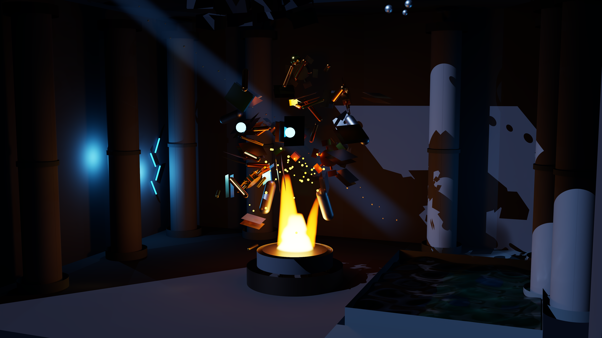

# SpectralDock

SpectralDock 是面向计算机图形学研究与教学的 NVIDIA GPU 离线路径追踪器。它用 CUDA 与 OptiX 完成硬件射线遍历和光传输，并通过隔离的 PhysX GPU 进程为需要刚体动力学的 Python 程序求解瞬时场景。



项目没有场景文件格式，也没有接收 `--scene` 参数的渲染主程序。每个示例都是普通 Python 程序：代码通过 SpectralDock API 添加相机、材质、几何和灯光，随后直接调用 `render()` 并明确指定分辨率、采样数与输出路径。

```python
from pathlib import Path
from spectraldock import Renderer

renderer = Renderer(device=0)
renderer.camera(
    look_from=(3.0, 2.0, 5.0),
    look_at=(0.0, 0.5, 0.0),
    up=(0.0, 1.0, 0.0),
    vfov=38.0,
    aperture=0.0,
    focus_distance=5.0,
)
renderer.background(type="constant", color=(0.01, 0.01, 0.015))
white = renderer.material(
    name="white", type="lambertian", base_color=(0.75, 0.75, 0.75)
)
renderer.object(
    name="floor", type="rectangle", material=white,
    p1=(-3.0, 0.0, 2.0), p2=(-3.0, 0.0, -3.0),
    p3=(3.0, 0.0, -3.0),
)
renderer.render(
    output=Path("output/first-light.png"),
    stats_output=Path("output/first-light.stats.json"),
    width=640, height=360, spp=64, depth=8, seed=1,
    denoise=True,
)
```

Python 程序是受信任的应用代码，而不是由 SpectralDock 解释的数据；项目不提供 Python 沙箱。

## 功能

- OptiX GAS/IAS、Program Group、Pipeline、SBT、`optixLaunch` 与 AI Denoiser。
- sphere、rectangle/sketch、disk、cylinder、parabola、共享 OBJ mesh 和有限解析波浪水面。
- Lambert、GGX metal、光滑/粗糙 dielectric、water 与 emitter。
- rectangle、disk、sphere 面积灯，point/directional delta 灯，以及程序化吸收/自发光 flame 体积。
- Radiance RGBE HDR 环境、经纬映射、旋转与亮度/立体角重要性采样。
- NEE、MIS、俄罗斯轮盘、介质栈、Beer 吸收与 direct/indirect firefly 贡献钳位。
- 类型化 Python handle；材质、网格、物体和灯光之间不使用字符串 schema 引用。
- 可选 PFM 线性输出和显式指定的 JSON 运行统计。JSON 仅用于运行记录与资产 manifest，不用于描述场景。
- 受限 PhysX Python API：GPU 刚体、box/sphere/capsule/compound 碰撞体、冲量和 actor-local 渲染附件。

## 已验证环境

| 组件 | 完整验证版本 |
| --- | --- |
| 操作系统 | Ubuntu 22.04 x86-64（Linux only） |
| GPU | NVIDIA GeForce RTX 5090 |
| 驱动 | 615.36 |
| Python | 3.10 |
| CUDA / OptiX 渲染 | CUDA 13.3 / OptiX 9.1 |
| PhysX 求解 | PhysX 5.8.0 / CUDA 12.8 |
| 构建工具 | CMake 3.28+、Ninja、C++17、pybind11 |

Windows、多 GPU、其他显卡以及其他 CUDA/OptiX 组合尚未完整验证。CUDA、OptiX 和 PhysX SDK 不随仓库分发；OptiX 的正式驱动与平台要求以 NVIDIA 文档为准。

## 宿主构建

SpectralDock 只支持仓库内宿主构建，不需要也不提供容器镜像。准备两个 CUDA toolkit、OptiX SDK 和已安装的 PhysX SDK，然后明确设置路径：

```bash
export SPECTRALDOCK_CUDA_ROOT=/absolute/path/to/cuda-13.3
export OPTIX_ROOT=/absolute/path/to/OptiX-SDK-9.1.0
export SPECTRALDOCK_PHYSX_CUDA_ROOT=/absolute/path/to/cuda-12.8
export PHYSX_ROOT=/absolute/path/to/physx-5.8-install

./scripts/configure.sh Release
./scripts/build.sh Release
source ./scripts/activate.sh Release
```

`activate.sh` 只把仓库内 Python 包、Renderer 原生扩展和独立 PhysX worker 加入当前 shell 的查找路径，不会发现、加载或执行任何场景程序。

只构建无 GPU 的 SceneBuilder 与 host 测试时，不需要上述 NVIDIA SDK：

```bash
./scripts/test.sh
```

## 直接运行示例

每个示例自行指定输出文件和渲染参数：

```bash
python3 scenes/material-cathedral.py
python3 scenes/radiance-pavilion.py
python3 scenes/kinetic-foundry.py
python3 scenes/lava-temple-oracle.py
```

八个静态示例直接进入 OptiX。两个物理示例在同一个 Python 程序中显式创建 `PhysicsWorld`、运行 fresh GPU PhysX、把结果应用到 `Renderer`，然后调用 OptiX；它们不会读取或生成场景 JSON，也不会回退到 CPU 物理。

维护者可用 `./scripts/render-examples.sh` 依次直接执行十个程序。该脚本只是批处理，不把 Python 文件作为参数传给渲染器。正式示例参数较高，其中封面为 3840×2160、2048 spp。

更多代码与效果说明见[示例画廊](docs/EXAMPLES.md)，API 见[Python 渲染 API](docs/PYTHON_API.md)，PhysX 数学与工程边界见[PhysX 场景说明](docs/PHYSX_SCENE.md)。

## 测试

GitHub Actions 只执行无 GPU 的 C++/Python host 检查。GPU 验收包括 MIS、灯光重要性采样、火焰、水面、HDR 环境、确定性输出、PhysX 契约及 Compute Sanitizer；标准托管 runner 不承担 GPU 或 PhysX 验收。

```bash
./scripts/test.sh
./scripts/acceptance.sh
```

gallery 与 mesh golden 只代表记录中的 RTX 5090、驱动、编译器和 seed，不是跨 GPU 的逐字节承诺。

## 已知限制

- 单 GPU、离线 PNG/PFM；没有交互窗口、分布式、多 GPU 或 motion blur。
- 不实现 MTL、骨骼、动画、通用参与介质、燃烧化学或流体动力学。
- `water_surface` 是静态有限解析界面，需要不透明池壁和池底；它不是 PhysX 流体。
- flame 是确定性吸收/自发光体积代理，不是烟流或燃烧模拟。
- point/directional 是理想 delta 灯；软阴影需使用有限面积灯。
- 默认 direct 64、indirect 16 的贡献钳位有偏；能量或收敛实验必须在 Python 调用中把两个阈值设为 0。
- PhysX GPU 不承诺重复运行逐字节相同；固定 seed 和 actor 顺序约束输入，契约验证约束结果。

## 许可与商标

代码、Python 示例、文档与生成器使用 Apache-2.0；明确列出的视觉资产和 gallery PNG 使用 CC0-1.0；tinyobjloader 保留 MIT。详见 [LICENSE](LICENSE)、[NOTICE](NOTICE)、[THIRD_PARTY_NOTICES.md](THIRD_PARTY_NOTICES.md) 和[素材清单](docs/ASSETS.md)。

NVIDIA、CUDA、OptiX、PhysX 和 RTX 是 NVIDIA Corporation 的商标或注册商标。SpectralDock 是独立的非官方项目，与 NVIDIA Corporation 无隶属关系，也未获得其赞助或背书。

更多资料：[版本变更](CHANGELOG.md)、[渲染技术报告](docs/technical-report/README.md)、[RTX 5090 运行记录](docs/BENCHMARK.md)。
