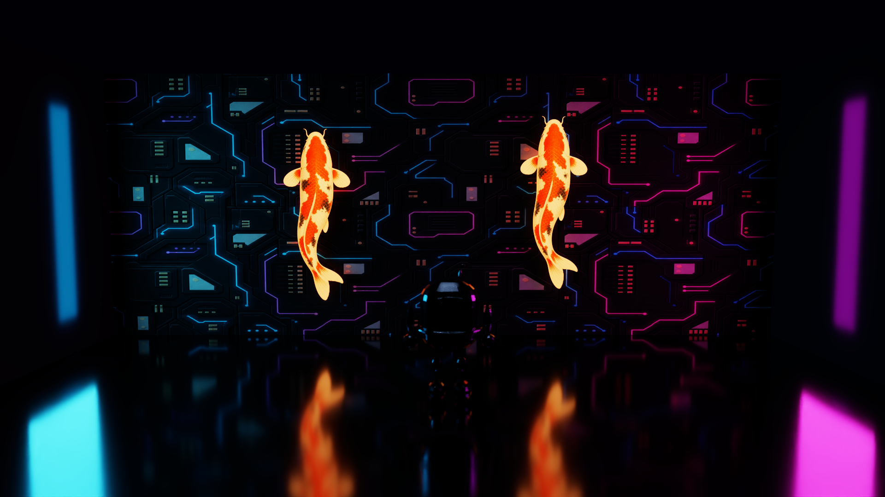

# SpectralDock

SpectralDock 是面向计算机图形学研究与教学的确定性离线路径追踪器。它以 NVIDIA RTX GPU 为实验平台，使用 CUDA 与 OptiX 完成硬件光线遍历，在一个可审查的 C++/CUDA 代码库中连接渲染方程、Monte Carlo 积分、材质与光传输、GAS/IAS、Pipeline/SBT、自定义求交、AI Denoiser 和 GPU 验证工具。



表面路径追踪是项目的核心教学链路；HDR 环境照明、重要性采样、程序化火焰与解析水面是高级光传输实验；PhysX 只作为可选的 GPU 刚体场景烘焙支线。仓库收录八个内置研究/展示场景所需的模型、纹理和 HDR 环境，以及 Kinetic Foundry 的 PhysX 生成记录，但不分发 CUDA、OptiX、PhysX 或其他外部 SDK。

## 学习与实验主线

- 从相机射线、渲染方程、BSDF 和 Monte Carlo 估计进入路径积分器，再学习 NEE、MIS 与俄罗斯轮盘。
- 把几何和材质映射到 OptiX 的 GAS、IAS、Program Group、Pipeline、SBT 与 `optixLaunch`，并观察 CUDA 设备程序如何参与遍历、求交和着色。
- 用 OBJ 实例、alpha any-hit、解析 primitive、异质火焰和波浪水面比较内建求交、自定义 intersection 与纯 CUDA 光传输工作的边界。
- 用 RTX 5090 运行记录、NVTX、Compute Sanitizer、定向 GPU fixture 和 OptiX Denoiser 观察 NVIDIA 软硬件栈，而不把一次设备结果外推为跨平台结论。

## 功能摘要

- 统一的 schema v5 场景加载，包含 sphere、rectangle/sketch、disk、cylinder、parabola、OBJ mesh、程序化 flame 光源与有限解析波浪水面；rectangle/sketch 在内部使用三角形 primitive。
- 网格资源共享压缩 GAS；每个实例拥有独立变换、正反面材质、纹理和 alpha。
- Lambert、GGX metal、光滑 dielectric 与 emitter，配合直接光采样、MIS 和俄罗斯轮盘。
- 线性 Rec.709 Radiance RGBE 环境贴图，支持经纬映射、强度和绕世界 +Y 旋转；环境 NEE 与 miss 端点通过 MIS 配对。
- 显式面积灯/球灯/火焰按功率代理选择，环境按亮度与精确 texel 立体角采样；场景可在 `importance` 与 `uniform` 间切换用于 A/B 教学对照。
- 无散射异质火焰的程序化密度、吸收/自发光传输、Delta Tracking 与体积 NEE。
- 最多四个确定性解析波浪水面，使用精确 Fresnel/Snell 光滑介电路径、RGB Beer 吸收、介质栈及跨水面直接光近似。
- 固定 seed 的确定性渲染、PNG 输出和同名 `*.stats.json` 运行记录。
- 八个内置 1920×1080 展示场景、一个固定在 300 步（2.5 秒）撞击峰值的 PhysX 5.8.0 GPU 刚体瞬时快照、低成本 smoke fixture、host-only 测试和手工 GPU 检查流程。

## 依赖与已验证平台

| 组件 | 项目用途 | 验证状态 |
| --- | --- | --- |
| 操作系统 | Linux；容器基于 Ubuntu 24.04 | 仅 Linux 完整验证 |
| NVIDIA GPU | 支持所用 OptiX 功能的 RTX GPU | 仅 GeForce RTX 5090 完整验证 |
| CUDA | `nvidia/cuda:13.3.0-devel-ubuntu24.04` 容器 | CUDA 13.3 |
| OptiX | 用户另行取得并解压 SDK | OptiX 9.1 |
| PhysX | 仅重新生成 Kinetic Foundry 时，由专用镜像获取并构建 | PhysX 5.8.0、CUDA 12.8.1 生成环境 |
| 容器运行时 | Docker Engine；GPU 流程需要 NVIDIA Container Toolkit | Linux 主机 |
| 构建与测试工具 | CMake 3.28+、Ninja、C++17、Python 3/pytest | 已包含在项目容器中 |

Windows、多 GPU、其他显卡及其他 CUDA/OptiX 组合尚未完整验证，不能由现有 gallery 或像素 golden 推断为兼容。OptiX 的正式平台和驱动要求以 [NVIDIA OptiX 下载与文档](https://developer.nvidia.com/designworks/optix/download) 为准。

## 获取 OptiX 与构建

从 NVIDIA 官方页面另行下载并解压 OptiX 9.1。SDK 不在本仓库中，也不会被复制进容器镜像；GPU 脚本要求显式提供其绝对路径：

```bash
export OPTIX_ROOT="/absolute/path/to/OptiX-SDK-9.1.0"
test -f "$OPTIX_ROOT/include/optix.h"

./scripts/build-image.sh
./scripts/configure.sh Release
./scripts/build.sh Release
```

构建产物位于 `build/Release/`。当前从构建目录或项目容器运行，因为可执行文件会加载同一构建树中的 OptiX IR。

PhysX 不参与渲染器构建或运行。只有重新生成 Kinetic Foundry 的刚体快照时才需要专用 PhysX 镜像；生成过程、固定版本和产物边界见 [PhysX 场景说明](docs/PHYSX_SCENE.md)。

## 低成本 smoke render

下面的命令渲染 64×64、1 spp、depth 2 的无降噪图片，适合先验证完整 GPU 路径：

```bash
./scripts/spectraldock.sh \
  --scene tests/scenes/smoke.json \
  --output output/smoke.png \
  --width 64 --height 64 --spp 1 --max-depth 2 --seed 1 \
  --no-denoise
```

结果写入 `output/smoke.png`，运行信息写入 `output/smoke.stats.json`。固定 CLI 为：

```text
spectraldock --scene SCENE.json --output OUTPUT.png
  [--width N] [--height N] [--spp N] [--max-depth N]
  [--seed N] [--exposure EV] [--denoise|--no-denoise]
```

CLI 参数覆盖场景默认值。`max_depth` 表示最多处理的表面事件数；最后一个事件仍估计显式直接光，但不会继续生成 BSDF 射线。

## 测试与示例

Host-only 测试不需要 NVIDIA GPU、OptiX SDK 或 PhysX：

```bash
./scripts/build-image.sh
./scripts/test.sh
```

它会完成 shell 语法检查、`SPECTRALDOCK_ENABLE_GPU=OFF` 的 CMake 构建与 CTest，并运行 `tests/test_technical_report_snippets.py` 和 `tests/test_hdr_environment_generator.py`。这条 CI 路径验证主机端场景/OBJ 解析、输入语义、技术报告的源码片段与数学标记，以及 HDR 资产的确定性重建；它不构建 `spectraldock` 渲染可执行文件、不执行像素渲染，也不是 CPU reference renderer。GPU 环境、MIS 对照、Compute Sanitizer 与像素 golden 的范围见 [RTX 5090 运行记录](docs/BENCHMARK.md)和[技术报告第 9 章](docs/technical-report/09-limitations-performance-and-validation.md)。

运行时模型和纹理已完整收录在 `assets/examples/`，无需额外素材挂载。普通预览写入被忽略的 `output/examples/`：

```bash
./scripts/render-examples.sh --preset preview
```

`./scripts/render-examples.sh --preset final` 会直接覆盖八个内置场景受版本控制的 gallery PNG 和对应 stats，用于重建同一组运行记录。Ember Forge 固定使用 2048 spp、depth 12 且不降噪；Moonlit Stepwell 固定使用 2048 spp、depth 16 且不降噪。Radiance Pavilion 只使用 HDR 环境照明。Kinetic Foundry 使用独立的 PhysX 生成/渲染入口，不在默认八场景批处理中。完整说明见[示例画廊](docs/EXAMPLES.md)。

## 已知限制

- 单 GPU、离线 RGBA PNG；没有交互窗口、分布式或多 GPU 渲染。
- 不实现 MTL、骨骼、动画、通用参与介质或通用非网格对象变换；flame 仅支持确定性异质吸收与自发光，不模拟散射、烟雾或燃烧化学。
- water_surface 是静态、有限的解析顶界面，不自带侧壁/底部，要求不透明池体封闭且相机从水外开始；含水场景的普通 dielectric 仅支持严格嵌套的闭合 sphere。它没有流体动力学、泡沫、焦散专用采样或运动模糊；直接光跨界使用直线 Fresnel/Beer 近似，不对 shadow ray 做 Snell 弯折。
- HDR 输入只支持常见 `-Y +X` 朝向的 Radiance RGBE `.hdr`（现代 RLE 或未压缩 scanline）；不读取 OpenEXR，也不输出 HDR。
- mesh emitter 可显示发光，但不能作为显式采样灯；显式灯为 rectangle、disk、sphere 或 schema v5 flame。
- Kinetic Foundry 截取固定第 300 步（2.5 秒）的撞击峰值，记录 0 个 sleeping dynamic actors；它是清晰的单帧瞬时静态快照，不含 motion blur，也不提供运行时物理、交互或动画。
- PhysX GPU 不支持 enhanced determinism；固定 seed、步长和 actor 顺序约束输入，但重复生成的最终姿态仍可能不同。生成脚本会拒绝穿地或越界样本并有限重试，`--verify` 检查的是两份独立输出各自满足场景契约。
- gallery 和 mesh 像素 golden 是一次 RTX 5090 结果，不是跨 GPU、驱动或编译器的逐字节承诺。

## 许可与商标

- 代码、文档、场景、SVG 和生成器：Apache License 2.0。
- 吉祥物 OBJ/manifest、为本项目生成的纹理和 gallery PNG：CC0 1.0 Universal。
- tinyobjloader：保留其 MIT 许可证。
- CUDA、OptiX、PhysX 及其他外部 SDK 不随仓库分发。

完整说明见 [LICENSE](LICENSE)、[NOTICE](NOTICE) 与[素材和许可清单](docs/ASSETS.md)。AI 生成纹理为本项目生成，按现状提供且不保证唯一性；其来源和处理记录见素材清单。

NVIDIA、CUDA、OptiX、PhysX 和 RTX 是 NVIDIA Corporation 在美国及其他国家和地区的商标或注册商标。SpectralDock 是独立的非官方项目，与 NVIDIA Corporation 无隶属关系，也未获得其赞助或背书。

更多资料：[渲染技术报告](docs/technical-report/README.md)、[场景格式](docs/SCENE_FORMAT.md)、[RTX 5090 运行记录](docs/BENCHMARK.md)、[示例画廊](docs/EXAMPLES.md)。
