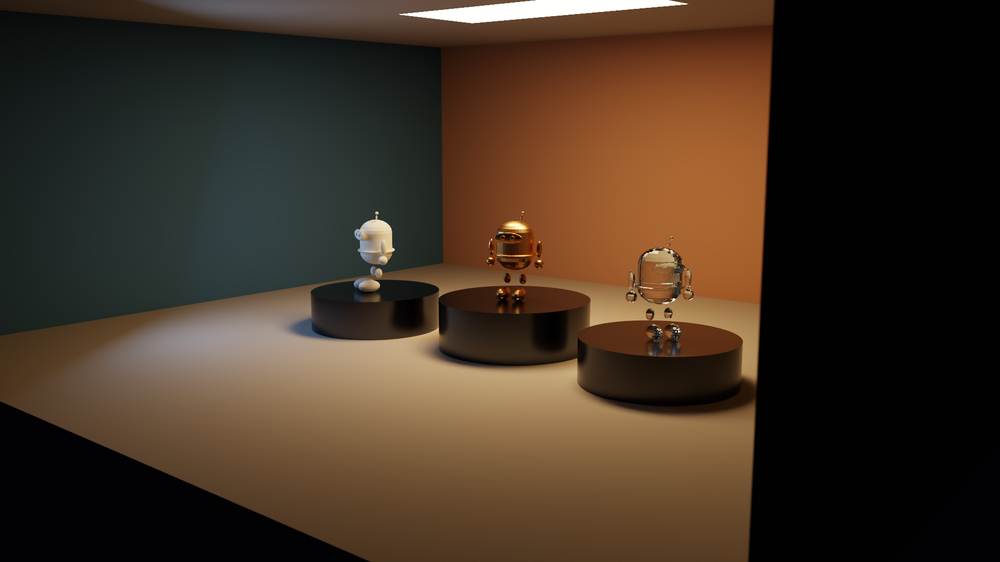
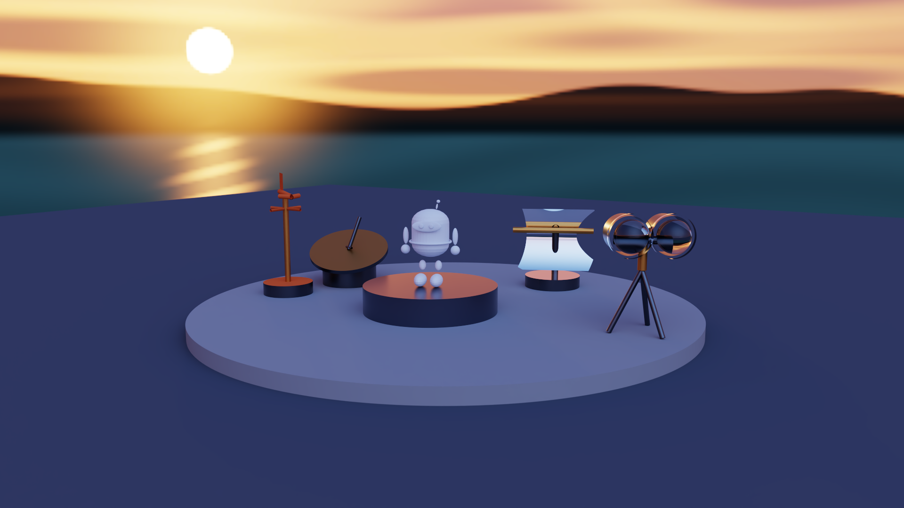
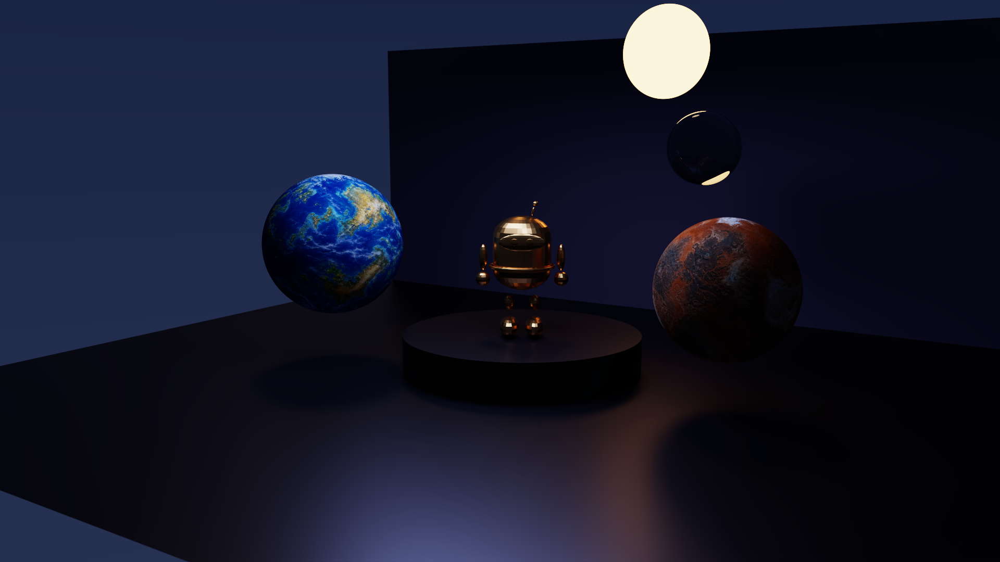
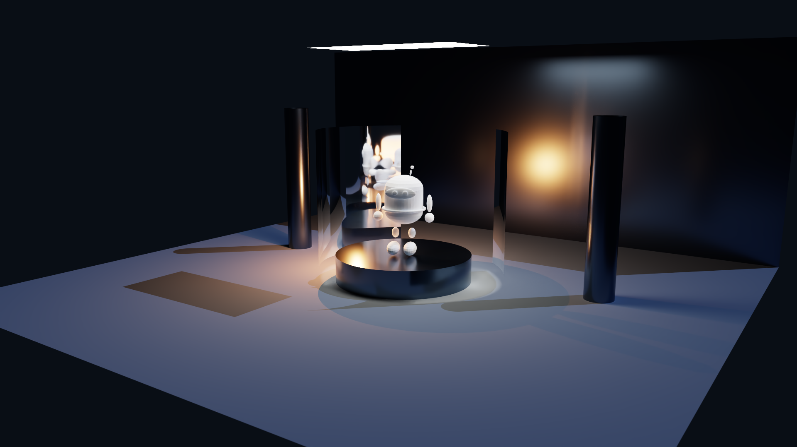
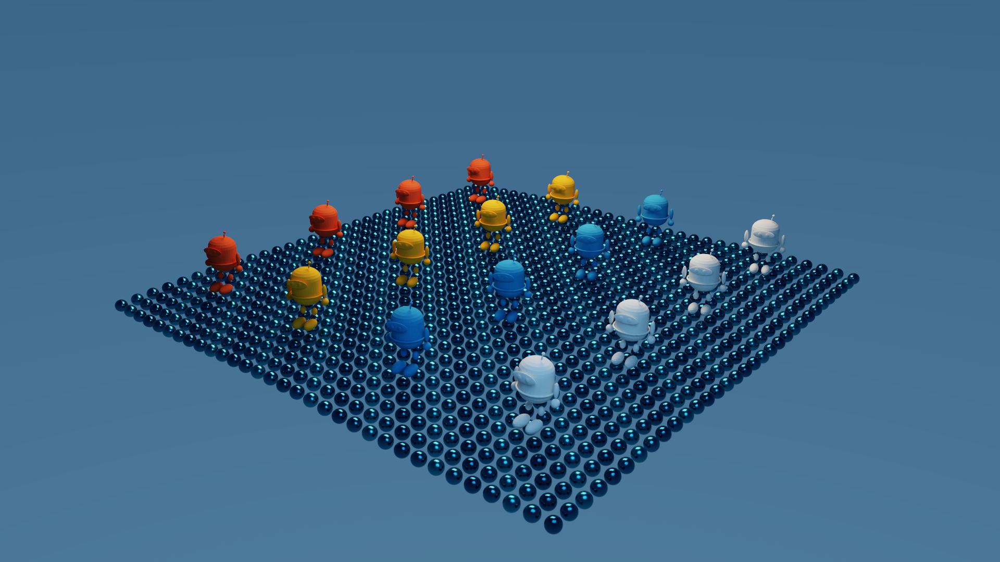
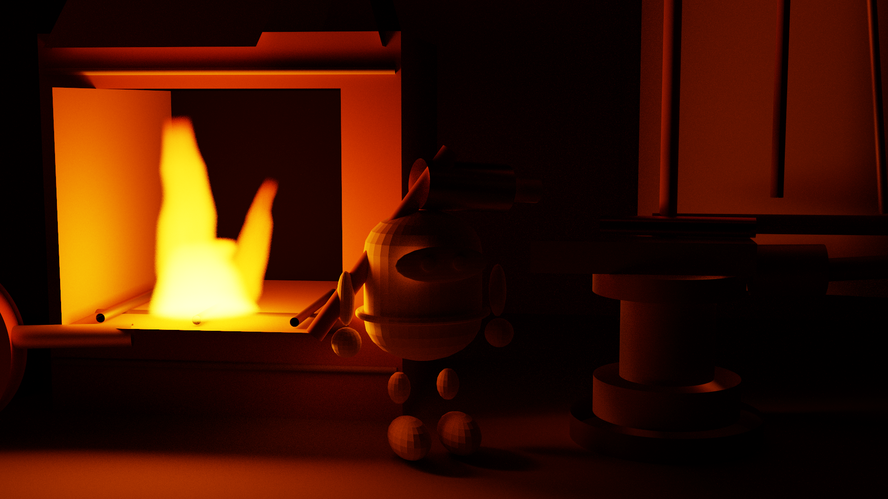
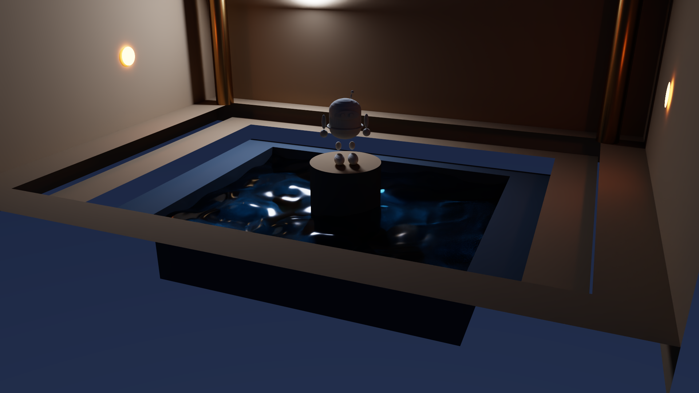
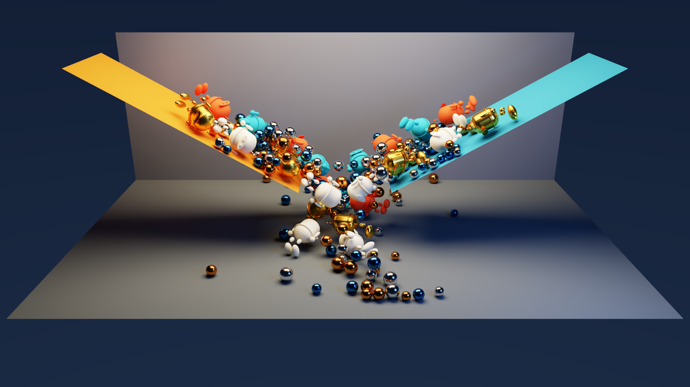

# 示例画廊：八个内置场景与一个按需 PhysX 场景

八个内置场景的正式图由 `./scripts/render-examples.sh --preset final` 直接写入 `docs/gallery/`；正式链接保持原始 1920×1080 PNG，不使用缩略图替代。Kinetic Foundry 由独立的 PhysX 流程生成，不加入默认批处理。

## Material Cathedral



三个胶囊吉祥物实例共享一份 5,816-triangle GAS，分别使用陶瓷、粗糙金属和玻璃。封闭建筑、矩形主光与圆盘补光用于观察 GGX、Fresnel、MIS、色彩反弹和 `T * Rz * Ry * Rx * S` 实例变换。

## Radiance Pavilion



开放式海岸 look-dev 展台以胶囊吉祥物为中央展品，四件户外观测装置沿非对称弧线展开：漫反射陶土风向标、粗糙青铜日晷、光滑铬抛物面日光镜和玻璃双透镜观测仪。场景没有 emitter，也没有任何显式 `lights`；2048×1024 的程序化 Radiance RGBE 日落海岸环境是唯一光源。环境贴图包含低角度金色夕阳、暖色分层云、冷色天顶、暗青海面、太阳反光带与远岛剪影，使各向异性的高动态热点和大范围天空补光同时出现在背景与材质响应中。schema v6 的 `direct_light_sampling: "importance"` 按线性亮度与 texel 立体角选择方向，并与 BSDF 采样进行 MIS，用这个唯一光源直观展示重要性采样如何减少样本浪费。正式配置固定为 1920×1080、512 spp、depth 12、seed 909，并启用 AI Denoiser。

## Neon Koi


透明锦鲤剪影、纹理 emitter、青/洋红面积光、无文字电路墙和湿润金属地面围绕一个深色金属胶囊吉祥物，集中展示 alpha any-hit、图像纹理、共享网格、彩色间接光、景深和 AI 降噪。

## Celestial Archive



青铜胶囊吉祥物作为中央展品，配两颗为本项目生成的 2:1 纹理星球、玻璃天体、天空渐变与太阳瓣，展示网格实例、球面 UV、天空照明和反射折射。

## Reflector Laboratory



白色陶瓷胶囊吉祥物置于两面抛物面反射器之间。可见 rectangle 顶灯提供柔和主光，左侧暖色 point 位于反射器焦点附近，冷色 directional 从固定无限远方向形成平行轮廓光；后两者不可见并产生硬阴影。场景同时展示自定义抛物面交点、单面材质、常用 delta 灯的逐灯 NEE，以及默认 direct 64 / indirect 16 钳位对尖锐金属高光离群值的控制。

## Benchmark Harbor



“泡泡海上的吉祥物船队”由 16 个四色胶囊吉祥物实例共享一份 5,816-triangle GAS，并由固定 seed `20260707` 生成 1,024 个互不重叠的球形波浪。该场景覆盖大 IAS、确定性生成、BVH 构建和吞吐率。

## Ember Forge



深夜封闭锻造工坊采用电影化的低机位三分之四构图：砖砌锻炉位于左侧视觉焦点，胶囊 mascot 作为铁匠站在铁砧与灼热工件之后，烟罩、工具架、风箱、淬火桶、钢材和梁柱填充纵深。单座炉火由三段相互重叠的 schema v6 程序化异质吸收—自发光体积构成：宽而明亮的炉芯、向上收尖的主火舌与轻微偏轴的副火舌；它们使用线性 RGB 轴向渐变、Delta Tracking 和体积 NEE，并非黑体、CFD、烟雾或动画。环境为纯黑，场景没有 emitter、面积灯或隐藏补光，全部可见照明只来自这组三段 flame；浅色耐火砖与中等反照率的粗糙金属通过直接光和间接反弹呈现暖色明暗层次。正式图固定为 2048 spp、depth 12、无 Denoiser，并使用展示场景默认的有偏贡献钳位；检查原始 Monte Carlo 长尾时应显式将两个 clamp 设为 0。

## Moonlit Stepwell



月光阶井用 rectangle、disk、cylinder 和同一 mascot OBJ 搭建石阶、池底、墙体与立柱。中央 schema v6 water_surface 是四项确定性解析波浪的有限高度场，并在解析宏观法线上叠加 `roughness: 0.12` 的 GGX 微表面：反射与折射使用精确介电 Fresnel、Smith 遮蔽、可见法线采样和 MIS，有限灯、flame、delta 灯与 HDR 环境都能在当前粗糙水面顶点执行 NEE；介质栈和 RGB Beer 吸收负责水下传播。为了不让水面这个视觉主体反而成为最慢收敛的部分，BSDF 以实际 PDF 补偿的方式把反射分支概率提高到至少 50%；有限灯在每个水面顶点分别取得一份全局功率样本和一份均匀索引样本，以二者的联合灯 PDF 与 BSDF 命中组成三技术 balance MIS，同时照顾月光和弱水下灯。所有球外连续 BSDF 顶点选中单面 sphere 灯时都均匀采其可见立体角；月盘本身是 disk，仍按灯面采样。场景固定 seed 808，以月盘粗糙反射、池底折射位移、深水蓝绿色选择性吸收和水下照明展示运行时水传输；它不是流体模拟，也不包含泡沫、动画、MNEE、光滑多界面焦散求解或 motion blur。正式图固定为 512 spp、depth 12，并启用 OptiX AI Denoiser；正式图使用有偏贡献钳位，维护者的线性 PFM 均值/收敛对照必须同时传 `--no-denoise --clamp-direct 0 --clamp-indirect 0`。

## Kinetic Foundry (PhysX)



该按需场景使用 PhysX 5.8.0 GPU 刚体模拟 24 个采用 capsule 碰撞代理的吉祥物与 192 颗钢珠，并在固定第 300 步（2.5 秒）截取撞击峰值；sidecar 记录 `sleeping_dynamic_actors=0`，即没有动态 actor 进入 sleeping 状态。SpectralDock/OptiX 渲染的是这一时刻清晰的静态单帧，不含 motion blur，不应解读为系统的最终静止状态。仓库只保留正式 PNG、渲染 stats 和同 stem 的 `.physics.json` 生成记录，不提交中间 `scenes/generated/kinetic-foundry.json`。PhysX 不参与路径追踪，也不会成为运行八个内置场景时的依赖；复现边界和命令见 [PhysX 场景说明](PHYSX_SCENE.md)。

## 运行

```bash
# 全部预览
./scripts/render-examples.sh --preset preview

# 全部正式图
./scripts/render-examples.sh --preset final

# 只渲染指定场景
./scripts/render-examples.sh --preset preview neon-koi reflector-laboratory
```

上述命令只处理八个内置场景；schema v6 正式场景都显式使用 direct 64 / indirect 16 钳位。Radiance Pavilion 的 final 使用场景内固定的 512 spp、depth 12 与 AI 降噪，Ember Forge 的 preview/final 分别固定为 256/2048 spp、depth 12、无降噪，Moonlit Stepwell 分别固定为 128/512 spp、depth 12、AI 降噪。只渲染 HDR 环境示例可运行 `./scripts/render-examples.sh --preset preview radiance-pavilion`，只渲染火焰场景可运行 `./scripts/render-examples.sh --preset preview ember-forge`。按需生成并渲染 Kinetic Foundry：

```bash
./scripts/build-physx-image.sh
OPTIX_ROOT="/absolute/path/to/OptiX-SDK-9.1.0" \
  ./scripts/render-physx-scene.sh --preset preview

# 仅维护者在验收后替换受版本控制的同名三件套；不增加资产数量
OPTIX_ROOT="/absolute/path/to/OptiX-SDK-9.1.0" \
  ./scripts/render-physx-scene.sh --preset final
```

正式静态几何统计和 RTX 5090 数据见 [BENCHMARK.md](BENCHMARK.md)。图像/模型来源与 CC0 使用条件见 [ASSETS.md](ASSETS.md)。
