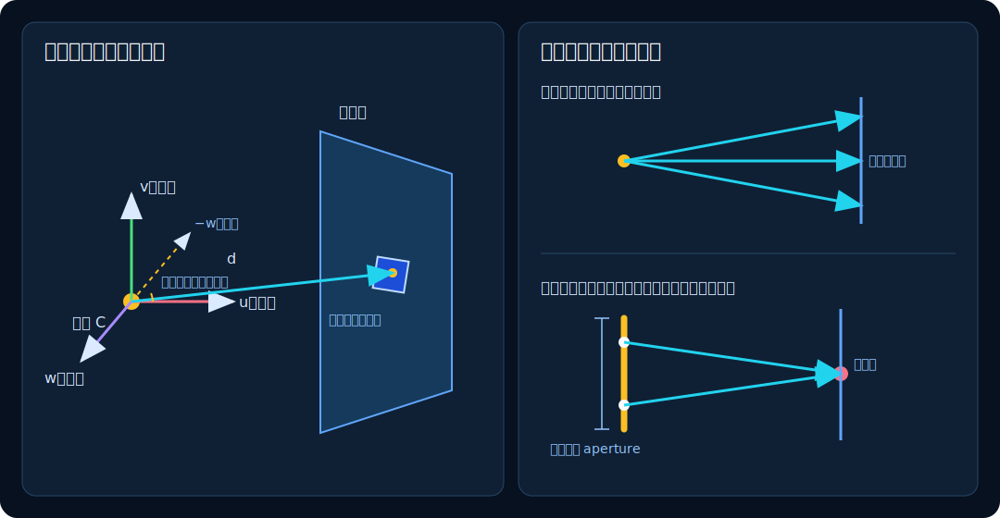

# 01　向量、射线与相机

本章回答第一个问题：**一个二维像素怎样变成三维世界里的一条射线？**

## 1. 点与向量

三维点 $\mathbf p=(p_x,p_y,p_z)$ 表示一个位置；向量 $\mathbf v=(v_x,v_y,v_z)$ 表示位移或方向。两点之差是向量：

$$
\mathbf v=\mathbf b-\mathbf a.
$$

向量长度和单位化分别是

$$
\|\mathbf v\|=\sqrt{v_x^2+v_y^2+v_z^2},
\qquad
\widehat{\mathbf v}=\frac{\mathbf v}{\|\mathbf v\|}.
$$

单位向量只保留方向，长度为 1。SpectralDock 把射线方向和法线都单位化，使距离、夹角和 PDF 的含义保持一致。

### 1.1 点积：一个方向有多“正对”另一个方向

$$
\mathbf a\cdot\mathbf b
=a_xb_x+a_yb_y+a_zb_z
=\|\mathbf a\|\,\|\mathbf b\|\cos\theta.
$$

若 $\mathbf a$ 与 $\mathbf b$ 都是单位向量，点积就是夹角余弦：

- 等于 1：同向；
- 等于 0：垂直；
- 小于 0：朝向相反的半空间。

例如灯光方向与表面法线夹角为 $60^\circ$，二者点积为 $\cos60^\circ=0.5$。同样强的光斜着照射时，只覆盖正面照射一半的投影面积。这正是渲染方程里的余弦因子。

### 1.2 叉积：构造一个垂直方向

$$
\mathbf a\times\mathbf b=
\begin{pmatrix}
a_yb_z-a_zb_y\\
a_zb_x-a_xb_z\\
a_xb_y-a_yb_x
\end{pmatrix}.
$$

叉积垂直于 $\mathbf a$ 和 $\mathbf b$，方向由右手定则决定，长度等于两向量张成的平行四边形面积。渲染器用它构造相机坐标轴、三角形法线和矩形面积。

## 2. 射线是带参数的直线

一条射线写成

$$
\mathbf r(t)=\mathbf o+t\mathbf d,\qquad t>0,
$$

其中 $\mathbf o$ 是起点，$\mathbf d$ 是单位方向，$t$ 是沿射线前进的距离。把几何体方程代入 $\mathbf r(t)$，求得的正数根就是交点；最小的有效正根代表肉眼能看到的最近表面。

这里的“射线”是数学对象，不对应一条主机端 CPU 渲染路径。当前生产实现只在设备程序中用 `float3` 的 origin/direction 保存射线状态，再交给 OptiX 遍历；主机端 `math.h` 只保留场景解析、相机和实例变换需要的向量与 AABB 基础类型。

实际浮点运算不精确。SpectralDock 把追踪区间下限设为 `scene_epsilon = 1e-4`；新 radiance/shadow 射线的起点还会沿出射一侧的着色法线偏移 `2 * scene_epsilon = 2e-4`。反射向法线正侧偏移，透射向负侧偏移。这是数值防护，不是物体的物理厚度。

## 3. 相机自己的三根坐标轴

令相机位置为 $\mathbf C$，观察目标为 $\mathbf T$，用户提供的上方向为 $\mathbf a$。SpectralDock 构造

$$
\mathbf w=\mathrm{normalize}(\mathbf C-\mathbf T),
$$

$$
\mathbf u=\mathrm{normalize}(\mathbf a\times\mathbf w),
\qquad
\mathbf v=\mathbf w\times\mathbf u.
$$

- $-\mathbf w$ 指向镜头前方；
- $\mathbf u$ 指向画面右方；
- $\mathbf v$ 指向画面上方。

三者互相垂直且长度为 1，构成相机的局部坐标系。若用户给出的上方向平行于观察方向，叉积为零，相机基会退化；场景加载器会明确拒绝这种输入。

### 源码对照：主机端相机参数

<!-- source-snippet id="camera-host-basis" path="src/optix_renderer.cpp" anchor="CameraData camera_for" -->
```cpp
CameraData camera_for(const Scene& scene, const RenderSettings& settings) {
  const Vec3 w = normalize(scene.camera.look_from - scene.camera.look_at);
  const Vec3 u = normalize(cross(scene.camera.up, w));
  const Vec3 v = cross(w, u);
  CameraData camera{};
  camera.origin = f3(scene.camera.look_from);
  camera.u = f3(u);
  camera.v = f3(v);
  camera.w = f3(w);
  camera.tan_half_fov =
      std::tan(scene.camera.vertical_fov_degrees * kPi / 360.0f);
  camera.aspect =
      static_cast<float>(settings.width) / static_cast<float>(settings.height);
  camera.lens_radius = 0.5f * scene.camera.aperture;
  camera.focus_distance = scene.camera.focus_distance;
  return camera;
}
```

公式中的 $\mathbf w,\mathbf u,\mathbf v$ 分别对应局部变量 `w`、`u`、`v`，随后被复制进设备端可见的 `camera`。角度从度转换到半角弧度，因此 `vertical_fov_degrees * kPi / 360.0f` 正是 $\theta_v/2$；`aspect`、`lens_radius` 和 `focus_distance` 则分别对应 $a$、$R$ 和 $F$。

## 4. 从像素坐标到焦平面

设输出宽高为 $W,H$，当前像素为整数 $(x,y)$。每个样本先产生两个均匀随机数 $\xi_x,\xi_y\in[0,1)$，在像素内部取一点：

$$
s_x=2\frac{x+\xi_x}{W}-1,
\qquad
s_y=1-2\frac{y+\xi_y}{H}.
$$

这把图像左上角附近映射到 $(-1,1)$，右下角附近映射到 $(1,-1)$。随机抖动不是人为添加的后期噪点；它是在估计像素覆盖区域的平均值，从而自然产生抗锯齿。

设纵向视场角为 $\theta_v$，宽高比 $a=W/H$，焦平面距离为 $F$。相对于相机位置的焦点向量是

$$
\mathbf p=F\left[
-\mathbf w
+s_xa\tan\frac{\theta_v}{2}\,\mathbf u
+s_y\tan\frac{\theta_v}{2}\,\mathbf v
\right].
$$

视场角越大，$\tan(\theta_v/2)$ 越大，同一张图便容纳越宽的世界范围，看起来更像广角镜头。

### 针孔相机

当光圈为零时，所有射线从同一点出发：

$$
\mathbf o=\mathbf C,
\qquad
\mathbf d=\mathrm{normalize}(\mathbf p).
$$

此时改变 $F$ 不改变画面视角，因为单位化会消去公共比例；`focus_distance` 主要在启用景深后才有视觉作用。

### 薄透镜景深

非零光圈把射线起点散布在镜头圆盘上。令光圈半径 $R=\text{aperture}/2$，再取 $\xi_1,\xi_2\in[0,1)$：

$$
r=\sqrt{\xi_1},\qquad \phi=2\pi\xi_2,
$$

$$
\boldsymbol\delta
=R\left(r\cos\phi\,\mathbf u+r\sin\phi\,\mathbf v\right).
$$

圆内半径小于 $r$ 的面积比例是 $r^2$，所以必须用 $r=\sqrt\xi$ 才能按面积均匀采样。若直接令 $r=\xi$，样本会错误地堆积在圆心。

最终射线为

$$
\mathbf o=\mathbf C+\boldsymbol\delta,
\qquad
\mathbf d=\mathrm{normalize}(\mathbf p-\boldsymbol\delta).
$$

不同起点的射线仍会聚到同一个焦平面点；焦平面附近清晰，前后位置因射线不再汇聚而模糊。

### 源码对照：从像素生成相机射线

<!-- source-snippet id="camera-device-ray-generation" path="src/device_programs.cu" anchor="generate_camera_ray" -->
```cpp
static __forceinline__ __device__ void generate_camera_ray(
    unsigned int x, unsigned int y, Pcg32& rng, float3& origin,
    float3& direction) {
  const float sx =
      2.0f * ((static_cast<float>(x) + rng.next()) / params.width) - 1.0f;
  const float sy =
      1.0f - 2.0f * ((static_cast<float>(y) + rng.next()) / params.height);
  const float3 focal_vector =
      mul(add(add(neg(params.camera.w),
                  mul(params.camera.u,
                      sx * params.camera.aspect * params.camera.tan_half_fov)),
              mul(params.camera.v, sy * params.camera.tan_half_fov)),
          params.camera.focus_distance);
  float3 lens_offset = f3(0.0f, 0.0f, 0.0f);
  if (params.camera.lens_radius > 0.0f) {
    const float2 lens = sample_disk(rng);
    lens_offset =
        mul(add(mul(params.camera.u, lens.x),
                mul(params.camera.v, lens.y)),
            params.camera.lens_radius);
  }
  origin = add(params.camera.origin, lens_offset);
  direction = normalize3(sub(focal_vector, lens_offset));
}
```

`sx`、`sy` 就是 $s_x,s_y$，其中两次 `rng.next()` 完成像素内抖动；`focal_vector` 对应 $\mathbf p$。光圈为零时 `lens_offset` 保持零，代码自然退化为针孔相机；否则 `sample_disk` 返回单位圆盘样本，再乘 `lens_radius` 得到 $\boldsymbol\delta$。最后两行逐字实现 $\mathbf o=\mathbf C+\boldsymbol\delta$ 与 $\mathbf d=\mathrm{normalize}(\mathbf p-\boldsymbol\delta)$，把两种相机统一在同一条控制流中。



*图 1：左侧是三维相机基在二维画布上的投影视意；右侧是针孔与薄透镜的侧视剖面。真实计算在三维空间进行。*

## 5. 一个小例子

若图像是 $800\times400$，则宽高比 $a=2$。纵向视场角为 $60^\circ$ 时，焦平面半高比例为

$$
\tan 30^\circ\approx0.577,
$$

半宽比例则为 $2\times0.577\approx1.155$。因此横向能看见的范围约为纵向两倍，像素仍保持正方形。

## 6. 对应实现

- 主机场景使用的向量、点积、叉积与 AABB：[`include/spectraldock/math.h`](../../include/spectraldock/math.h)
- 主机端相机基和视场参数：[`camera_for`](../../src/optix_renderer.cpp)
- 像素抖动、圆盘采样、相机射线与 OptiX 追踪：[`sample_disk`、`generate_camera_ray`、`trace_radiance`](../../src/device_programs.cu)

下一章将回答：这条射线进入场景后，渲染器究竟要计算什么物理量？

[返回目录](README.md) · [下一章：光的度量与渲染方程](02-light-and-rendering-equation.md)
