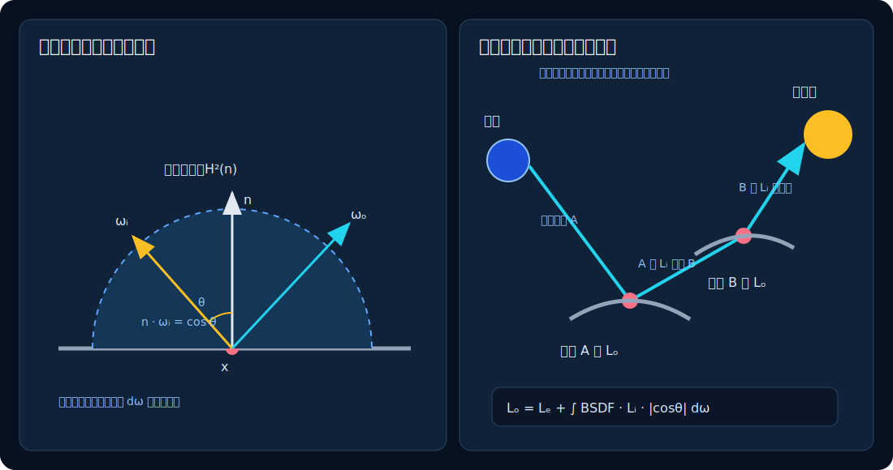

# 02　光的度量与渲染方程

上一章得到了一条相机射线。本章回答整个报告最核心的问题：**这条射线对应的颜色，数学上是什么？**

## 1. 光不是“一个亮度值”

同一个位置可能同时有来自天空、灯具和墙面的光；它们的方向不同，颜色和强度也不同。因此渲染不能只给空间中每个点存一个亮度，必须描述“某个位置、沿某个方向传播的光”。

### 1.1 立体角：方向在球面上占多大

二维角度可以理解为一段圆弧占半径的比例；三维的**立体角**描述一个物体从观察点看去占单位球面的面积。单位是球面度 sr：

- 整个球面是 $4\pi$ sr；
- 一个半球是 $2\pi$ sr。

设着色点为 $\mathbf x$，灯面上的小块为 $dA$，二者距离为 $r$，从 $\mathbf x$ 指向灯的方向为 $\boldsymbol\omega$，灯面法线为 $\mathbf n_l$。这个小块在 $\mathbf x$ 看来占据

$$
d\omega=
\frac{|\mathbf n_l\cdot(-\boldsymbol\omega)|}{r^2}\,dA.
$$

距离加倍后，同一块灯面占据的立体角约缩小到四分之一；灯面斜对着观察点时，投影面积也变小。第 5 章会用这个关系把“在灯面上随机取点”转换为“随机选择方向”的 PDF。

### 1.2 辐亮度：沿一个方向传播多少光

先读懂三个记号：$\Phi$ 表示一段时间内通过的总光流；$d$ 表示“无限小的一份”，例如 $dA$ 是一小块面积；积分号 $\int$ 表示把无数小份贡献相加。

辐亮度可写为

$$
L=\frac{d^2\Phi}{\cos\theta\,dA\,d\omega},
$$

其中 $d\Phi$ 是微小光通量，$dA\cos\theta$ 是与传播方向垂直的投影面积，$d\omega$ 是微小立体角。它回答：“单位投影面积、单位方向范围内，有多少光能传播？”

SpectralDock 不做光谱或绝对物理单位仿真，而用三个线性数 $(L_r,L_g,L_b)$ 近似红、绿、蓝三个宽波段的相对辐亮度。它们可以大于 1，最后才映射到显示器范围。

一个容易误解的事实是：在没有吸收的真空中，沿一条射线传播的辐亮度不会因为距离自动变小。远处面积灯看起来更暗，主要因为它在观察点占据的立体角按 $1/r^2$ 缩小，而不是射线携带的数值沿途被除以 $r^2$。

### 1.3 面积灯、点光与平行光的量不同

rectangle、disk 和 sphere 灯描述有限表面发出的辐亮度 $L_e$。point 灯把有限功率理想化为零面积位置，Python `Renderer.light()` 的 RGB `intensity` 表示辐射强度 $I$；它在距离 $r$ 处产生与 $I/r^2$ 成正比的入射量。directional 灯把光源放到无限远，所有连接方向平行，API 的 RGB `irradiance` 直接表示辐照度 $E$，不随着色点平移而变化。

对路径吞吐量 $\boldsymbol\beta$、BSDF $f_s$ 和从表面指向光源的方向 $\boldsymbol\omega_i$，忽略遮挡与介质时，两者的单灯贡献分别为

$$
\mathbf C_p=
\boldsymbol\beta\odot f_s I
\frac{|\mathbf n_s^{\mathrm{eff}}\cdot\boldsymbol\omega_i|}{r^2},
\qquad
\mathbf C_d=
\boldsymbol\beta\odot f_s E
|\mathbf n_s^{\mathrm{eff}}\cdot\boldsymbol\omega_i|.
$$

这里写的是 SpectralDock 连续 BSDF 求值器实际融合的着色余弦；$\mathbf n_s^{\mathrm{eff}}$ 是第 3 章定义的有效着色法线。连接是否位于真实表面的反射或透射侧仍由几何法线 $\mathbf n_g$ 判断，着色法线不会改变介质侧别。

point 和 directional 在方向测度上都是 delta 分布：它们没有可抽样的灯面，也不会被一条连续 BSDF 射线偶然命中。SpectralDock 因而在每个支持 NEE 的连续 BSDF 顶点逐盏连接它们，MIS 权重为 1；阴影由有限距离或无限距离的 shadow ray 决定。`directional.direction` 与 sky 的 `sun_direction` 语义一致，都是**从着色点指向光源**，与真实光传播方向相反。

## 2. 表面接收的光：半球积分

在理想几何表面点 $\mathbf x$ 上，只有几何法线 $\mathbf n_g$ 上方的方向能从外部照到表面。把这个半球记为 $\mathcal H^2(\mathbf n_g)$。表面接收到的辐照度为

$$
E(\mathbf x)=
\int_{\mathcal H^2(\mathbf n_g)}
L_i(\mathbf x,\boldsymbol\omega_i)
\max(0,\mathbf n_g\cdot\boldsymbol\omega_i)
\,d\omega_i.
$$

这里：

- $L_i$ 是从方向 $\boldsymbol\omega_i$ 到达表面的入射辐亮度；
- $\max(0,\mathbf n_g\cdot\boldsymbol\omega_i)$ 是真实几何表面的入射余弦；
- $d\omega_i$ 是一个无限小的方向区域。

积分可先理解成“把半球切成许多很小的方向格子，再把每格贡献相加”。格子越小，离散和越接近连续积分：

$$
E\approx\sum_j L_i(\boldsymbol\omega_{i,j})
\max(0,\mathbf n_g\cdot\boldsymbol\omega_{i,j})\,\Delta\omega_j.
$$

余弦项来自投影面积。它不是为了让物体看起来立体而添加的经验效果，而是几何测量本身的一部分。

## 3. 材质需要描述“从哪里来、到哪里去”

同样的入射光照到白墙、金属和玻璃，会被送往不同方向。用 BSDF $f_s(\mathbf x,\boldsymbol\omega_i,\boldsymbol\omega_o)$ 描述这种方向转换：

- $\boldsymbol\omega_i$：从交点指向光的来源或下一路径顶点；
- $\boldsymbol\omega_o$：从交点指向观察者或上一顶点；
- $f_s$：单位入射辐照度对给定出射方向贡献多少辐亮度。

对于普通反射部分，BSDF 也常称 BRDF。其连续部分单位为 sr$^{-1}$。玻璃的完美反射和折射是只存在于单一方向的 delta 事件，不能用普通有限函数值完整描述，第 3 章会单独处理。

## 4. 渲染方程

表面沿 $\boldsymbol\omega_o$ 离开的光，由“自己发出的光”和“把所有入射方向散射过来的光”组成。为了同时覆盖反射与穿过介电界面的透射，广义 BSDF 方程在整个方向球面 $\mathcal S^2$ 上积分：

$$
\boxed{
L_o(\mathbf x,\boldsymbol\omega_o)
=L_e(\mathbf x,\boldsymbol\omega_o)
+\int_{\mathcal S^2}
f_s(\mathbf x,\boldsymbol\omega_i,\boldsymbol\omega_o)
L_i(\mathbf x,\boldsymbol\omega_i)
|\mathbf n_g\cdot\boldsymbol\omega_i|
\,d\omega_i
}
$$

在理想几何表面上，$\mathbf n_s^{\mathrm{eff}}=\mathbf n_g$；Lambert、metal 和 PBR 只有几何反射侧的支撑，公式便退化为第 2 节相对于 $\mathbf n_g$ 的上半球积分。介电质折射方向位于另一侧，必须保留全球积分和绝对几何余弦。

平滑顶点法线或 normal map 会让两根法线不同。当前估计器仍用 $\mathbf n_g$ 判断真实反射/透射侧，但连续 BSDF 把 $|\mathbf n_s^{\mathrm{eff}}\!\cdot\boldsymbol\omega_i|$ 融入 `f_cos`。因此某方向可以位于几何反射侧、却落在有效着色法线的负半球：灯光策略仍能求值该方向，而只在着色正半球取样的 BSDF PDF 为 0。第 3 章会给出这个 `AbsDot` 扩展和有效法线修正规则；它不等于用着色法线改写真实表面的侧别。

| 符号 | 含义 |
|---|---|
| $\mathbf x$ | 当前交点 |
| $\mathbf n_g$ | 朝当前射线一侧的单位几何法线 |
| $\mathbf n_s^{\mathrm{eff}}$ | 连续 BSDF 使用的有效着色法线 |
| $L_e$ | 表面自己发出的辐亮度 |
| $L_i$ | 某方向到达表面的入射辐亮度 |
| $L_o$ | 沿观察方向离开表面的出射辐亮度 |
| $f_s$ | 材质的散射规律 |
| $\mathcal S^2$ | 表面点周围的完整方向球面 |



*图 2：左侧画的是不透明反射的上半球特例；广义方程还包含法线另一侧的透射。右侧说明 $L_i$ 来自另一表面的 $L_o$。青线箭头是相机端查询方向，物理光能传播方向相反。*

### 4.1 为什么它是递归方程

当前表面某方向的 $L_i$，通常就是该方向上另一个表面的 $L_o$。那个表面的 $L_o$ 又依赖更多表面的入射光。镜间多次反射、墙面间的颜色渗透和间接照明都藏在这个递归关系里。

> **进阶旁注：**只要理解“下一表面的出射光成为当前表面的入射光”，就可以跳过下面的算子写法。

形式上可以把光传输写成

$$
L=L_e+\mathcal K L,
$$

其中 $\mathcal K$ 是一次传播加一次表面散射的算子。反复展开得到

$$
L=L_e+\mathcal K L_e+\mathcal K^2L_e+\mathcal K^3L_e+\cdots.
$$

各项分别对应直接看见光源、一次散射、两次散射、三次散射等路径。路径追踪就是随机抽取这些路径来估计无穷级数。

### 4.2 SpectralDock 求解的具体问题

当前渲染器作以下建模选择：

- **稳态**：不模拟光传播时间；
- **RGB**：不按波长计算光谱；
- **表面为主**：没有通用散射介质、雾或次表面传输；程序化 flame 只估计吸收—自发光，解析 water 只加入均匀 RGB 吸收；
- **几何光学**：不模拟衍射和干涉；
- **离线积分**：每个像素使用多条随机路径，不以实时帧率为设计目标。
- **方向背景**：既支持常量与简化 sky，也支持线性 RGB Radiance HDR 纬经环境；仍不模拟光度学太阳、大气散射或光谱天空。

这些边界不妨碍它展示路径追踪的核心数学，但决定了结果不能被称作对现实世界的完整物理仿真。

## 5. 源码如何对应方程

[`__raygen__pathtrace`](../../src/device_programs.cu) 及同一编译单元内的设备局部 helper 构成渲染方程的随机估计器；项目没有另一套 CPU 渲染实现：

1. 射线未命中时，把背景辐亮度加入结果；
2. 命中发光面时，把带路径吞吐量和必要 MIS 权重的 $L_e$ 加入结果；
3. 命中普通表面时，显式估计一份直接光；
4. 再按 BSDF 随机选择一个方向，让路径继续到下一个表面。

代码不是在网格上直接求解积分方程，也不是递归调用自身。它在 ray-generation 程序内部维护一条迭代路径；数学上的递归由循环中的下一条射线表示。

### 5.1 路径状态与背景项

<!-- source-snippet id="raygen-path-state-background" path="src/device_programs.cu" anchor="background(ray_direction)" -->
```cpp
      if (volume.collided != 0) {
        if (previous_delta != 0) {
          accumulate_path_contribution(
              radiance, mul(throughput, volume.source), clamp_threshold,
              clamped_counter);
        }
        break;
      }
      if (hit.hit == 0) {
        const float environment_pdf =
            previous_delta == 0 ? environment_direction_pdf(ray_direction)
                                : 0.0f;
        const float miss_weight =
            previous_delta != 0 || !(environment_pdf > 0.0f)
                ? 1.0f
                : power_heuristic(previous_pdf, environment_pdf);
        accumulate_path_contribution(
            radiance,
            mul(mul(throughput, background(ray_direction)), miss_weight),
            clamp_threshold, clamped_counter);
        break;
      }
```

`radiance` 是当前样本已经累计的 $L_o$ 估计，`throughput` 是此前各次散射权重的乘积 $\boldsymbol\beta$。体积真实碰撞先按第 10 章的互斥策略处理；没有碰撞且射线未命中表面时，方向背景就是路径末端的 $L_i$。若前一事件是非 delta 表面且背景为可显式采样的 HDR 环境，同一路径也可能由环境 NEE 生成，因此再乘 BSDF 一侧的 `miss_weight`；常量、sky、相机直达或 delta 前驱的权重仍为 1。循环代替函数递归，`break` 表示这条光路已经终止。

### 5.2 发光面项

<!-- source-snippet id="raygen-emitter-accumulation" path="src/device_programs.cu" anchor="mul(mul(throughput, emitted), weight)" -->
```cpp
        accumulate_path_contribution(
            radiance, mul(mul(throughput, emitted), weight),
            clamp_threshold, clamped_counter);
        break;
```

这里的 `emitted` 对应 $L_e$，纹理只调制它的 RGB；`throughput` 仍是 $\boldsymbol\beta$。`weight` 根据真正存在的竞争策略决定：普通 NEE/BSDF 命中端的规则见第 5 章，粗糙 water 的专用多提议 balance 见第 11 章。未绑定 emitter、delta 前驱和相机直见保留完整权重。Emitter 是终端材质，累加后立即 `break`。

### 5.3 直接光与下一次散射

有限灯、HDR 环境和 delta 灯是三个独立 NEE 域。普通表面在前两个域各取一份随机样本，point/directional 则逐灯求值且权重为 1；某些专用顶点可在有限灯域增加一份提议，具体构造留到第 11 章。每份结果乘当前 throughput 后独立加入 `radiance`，PDF、余弦或遮挡检查都可提前返回。最后一个表面事件仍计算直接光，之后才停止。

`wo` 对应 $\boldsymbol\omega_o$；各域结果乘当前 $\boldsymbol\beta$ 后才加入 `radiance`。需要拆分时，每份策略贡献独立进入 `accumulate_path_contribution`；没有 delta 灯且各项都不触发 clamp 时，紧邻这段之前的 `preserve_grouped_add` 分支仍使用旧加法树。实现为平滑网格保留一根有效着色法线 $\mathbf n_s^{\mathrm{eff}}$：Lambert、PBR 与其他 GGX 连续分支的路径权重按 PBRT 风格使用 $f_s|\mathbf n_s^{\mathrm{eff}}\!\cdot\boldsymbol\omega_i|/p_B$。几何法线 $\mathbf n_g$ 仍独立负责真实反射/透射侧、介质栈转换与射线起点偏移。`roughness = 0` 的 dielectric/water 是离散 delta 界面，Fresnel、Snell 方向与侧别全部使用 $\mathbf n_g$，透射权重还包含 $(\eta_i/\eta_t)^2$。无下一跳、无效样本或零吞吐量都会尽早结束路径，避免无贡献追踪。

下一章先研究方程中的材质项 $f_s$，再讨论如何用随机样本估计整个积分。

[上一章：向量、射线与相机](01-vectors-rays-and-camera.md) · [返回目录](README.md) · [下一章：材质与 BSDF](03-materials-and-bsdf.md)
