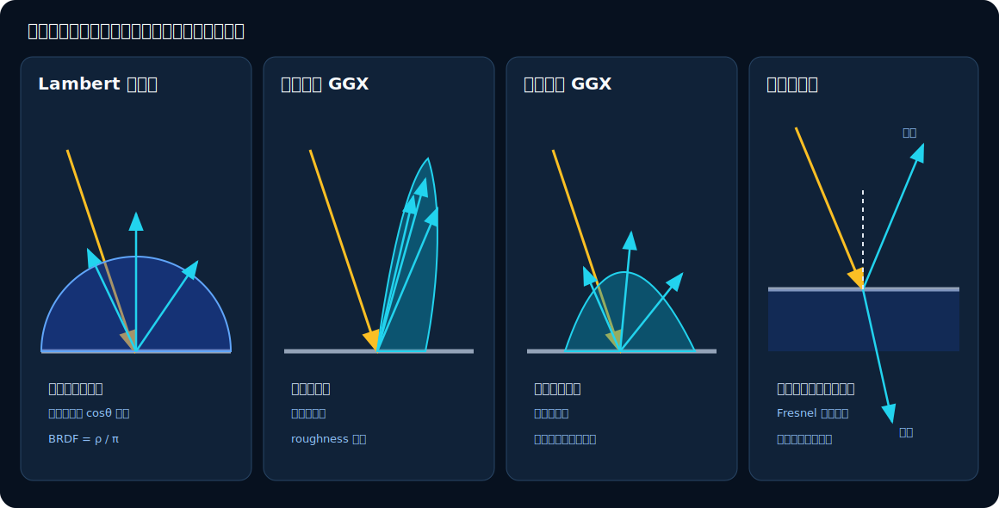

# 03　材质与 BSDF：表面怎样改变光

渲染方程中的 $f_s$ 决定光到达表面后去向哪里。本章依次解释 SpectralDock 的四类材质：Lambert 漫反射、GGX 金属、光滑介电质和发光表面。

## 1. BSDF 是方向之间的“路由规则”

固定观察方向 $\boldsymbol\omega_o$ 后，BSDF

$$
f_s(\boldsymbol\omega_i,\boldsymbol\omega_o)
$$

描述从 $\boldsymbol\omega_i$ 到达的光，有多少被散射到 $\boldsymbol\omega_o$。可以把它想成画在表面上方的方向分布：

- 分布宽而均匀：外观接近哑光；
- 分布窄且集中：外观接近镜面；
- 只有一个反射或折射方向：理想光滑界面。



*图 3：黄色箭头是入射方向，青色箭头是可能的出射方向，轮廓表示 BSDF 的相对集中程度。介电质的反射和折射是离散 delta 方向。*

## 2. Lambert 漫反射

理想漫反射假设表面把光均匀送往上方所有观察方向。BRDF 为

$$
f_r=\frac{\boldsymbol\rho}{\pi},
$$

其中 $\boldsymbol\rho=(\rho_r,\rho_g,\rho_b)$ 是 `base_color`，可理解为每个 RGB 通道的反射比例。

为什么要除以 $\pi$？半球上的余弦积分为

$$
\int_{\mathcal H^2}\cos\theta\,d\omega=\pi.
$$

因此将 $\boldsymbol\rho/\pi$ 代入渲染方程，白色均匀环境下的总反射比例恰好是 $\boldsymbol\rho$，不会凭空多出一个 $\pi$ 倍能量。

### 2.1 余弦加权采样为什么特别合适

渲染方程的被积函数自带 $\cos\theta$。SpectralDock 用同样形状的 PDF 选择方向：

$$
p_B(\boldsymbol\omega_i)=
\frac{\max(0,\mathbf n\cdot\boldsymbol\omega_i)}{\pi}.
$$

一次随机样本的路径权重便化简为

$$
\frac{f_r\cos\theta}{p_B}
=\frac{(\boldsymbol\rho/\pi)\cos\theta}{\cos\theta/\pi}
=\boldsymbol\rho.
$$

这就是 [`sample_bsdf`](../../src/device_programs.cu) 的 Lambert 分支直接令 `sample.weight = base_color` 的原因。代码不是漏掉了 BRDF、余弦或 PDF；它们在代数上已经约掉。

### 源码对照：Lambert 采样与化简后的权重

<!-- source-snippet id="lambert-cosine-sampling" path="src/device_programs.cu" anchor="kMaterialLambertian" -->
```cpp
  if (material.type == spectraldock::kMaterialLambertian) {
    const float r1 = rng.next();
    const float r2 = rng.next();
    const float radius = sqrtf(r1);
    const float phi = 2.0f * kPi * r2;
    const float3 local =
        f3(radius * cosf(phi), radius * sinf(phi), sqrtf(1.0f - r1));
    sample.wi = local_to_world(local, n);
    sample.pdf = fmaxf(dot3(n, sample.wi), 0.0f) * kInvPi;
    sample.weight = base_color;
    sample.valid = sample.pdf > 0.0f;
    sample.delta = 0;
    return sample;
  }
```

`r1`、`r2` 是两个均匀随机数，局部方向的 $z=\sqrt{1-r_1}$ 产生余弦加权半球分布；`local_to_world` 再把它绕法线 `n` 旋转到世界坐标。`sample.pdf` 逐字对应 $p_B=(\mathbf n\cdot\boldsymbol\omega_i)/\pi$，而 `sample.weight = base_color` 对应化简后的 $\boldsymbol\rho$。`delta = 0` 明确它是连续分布。

## 3. GGX 粗糙金属

粗糙金属可想成大量方向不同的微小镜面。宏观法线是 $\mathbf n$，真正完成一次镜面反射的微表面法线是半程向量

$$
\mathbf h=
\mathrm{normalize}(\boldsymbol\omega_o+\boldsymbol\omega_i).
$$

只有法线接近 $\mathbf h$ 的微镜面，才能把一个方向反射到另一个方向。

### 3.1 粗糙度与法线分布

当前实现把用户粗糙度转换为

$$
\alpha=\max(\text{roughness}^2,0.001).
$$

GGX 法线分布函数为

$$
D(\mathbf h)=
\frac{\alpha^2}
{\pi\left[(\mathbf n\cdot\mathbf h)^2(\alpha^2-1)+1\right]^2}.
$$

小 $\alpha$ 让微法线集中在 $\mathbf n$ 附近，高光尖锐；大 $\alpha$ 让它们分散，高光变宽。即使 `roughness = 0`，$\alpha$ 仍被钳到 0.001，所以它不是数学上的完美 delta 镜面。

### 3.2 遮蔽、Fresnel 与完整 BRDF

斜着排列的微表面可能互相遮挡。SpectralDock 使用 Smith 项

$$
G_1(c)=
\frac{2c}{c+\sqrt{\alpha^2+(1-\alpha^2)c^2}},
$$

$$
G=G_1(\mathbf n\cdot\boldsymbol\omega_o)
G_1(\mathbf n\cdot\boldsymbol\omega_i).
$$

四个字母的职责是：$D$ 描述微法线朝向分布，$G$ 描述微表面互相遮挡，$\mathbf F$ 是随角度变化的 Fresnel 反射率，$\mathbf F_0$ 是正入射反射率；$G_1$ 的输入 $c$ 是 $[0,1]$ 内的方向余弦。

Fresnel 效应表示掠射角反射通常更强。Schlick 近似为

$$
\mathbf F=\mathbf F_0+
(\mathbf 1-\mathbf F_0)
(1-\boldsymbol\omega_o\cdot\mathbf h)^5.
$$

### 源码对照：GGX 的 $D$、$G_1$ 与 $\mathbf F$

<!-- source-snippet id="ggx-distribution-geometry-fresnel" path="src/device_programs.cu" anchor="ggx_distribution" -->
```cpp
static __forceinline__ __device__ float ggx_distribution(
    float no_h, float alpha) {
  const float a2 = alpha * alpha;
  const float d = no_h * no_h * (a2 - 1.0f) + 1.0f;
  return a2 / fmaxf(kPi * d * d, 1.0e-20f);
}

static __forceinline__ __device__ float ggx_g1(float no_x, float alpha) {
  const float a2 = alpha * alpha;
  return 2.0f * no_x /
         fmaxf(no_x + sqrtf(a2 + (1.0f - a2) * no_x * no_x), 1.0e-20f);
}

static __forceinline__ __device__ float3 fresnel_schlick(
    float cos_theta, float3 f0) {
  const float x = 1.0f - fminf(fmaxf(cos_theta, 0.0f), 1.0f);
  const float x2 = x * x;
  const float x5 = x2 * x2 * x;
  return add(f0, mul(sub(f3(1.0f, 1.0f, 1.0f), f0), x5));
}
```

`no_h`、`no_x` 和 `cos_theta` 分别承载 $\mathbf n\cdot\mathbf h$、$G_1$ 的余弦 $c$ 与 $\boldsymbol\omega_o\cdot\mathbf h$。实现预先计算 `a2`、`x2`、`x5`，减少重复乘法；分母用 `fmaxf(..., 1.0e-20f)` 防止极端方向产生除零或非有限值，Fresnel 输入则先钳到 $[0,1]$。

于是 GGX BRDF 为

$$
f_r=
\frac{\mathbf F D G}
{4(\mathbf n\cdot\boldsymbol\omega_o)
(\mathbf n\cdot\boldsymbol\omega_i)}.
$$

这里分母中的换行是普通乘法：即 $4\,n_o n_i$，不是加法。

当前场景加载逻辑把 `metal` 的 `metallic` 固定为 1，所以实际的 $\mathbf F_0$ 直接取自 `base_color`。这是一种纯金属镜面微表面模型，不是常见的“金属度工作流”，也不含漫反射与镜面混合。

### 源码对照：完整 BRDF 与方向 PDF

<!-- source-snippet id="ggx-brdf-direction-pdf" path="src/device_programs.cu" anchor="half_vector" -->
```cpp
  const float3 half_vector = normalize3(add(wo, wi));
  const float no_h = fmaxf(dot3(n, half_vector), 0.0f);
  const float vo_h = fmaxf(dot3(wo, half_vector), 0.0f);
  if (no_h <= 0.0f || vo_h <= 0.0f) {
    return;
  }
  const float alpha =
      fmaxf(material.roughness * material.roughness, 0.001f);
  const float d = ggx_distribution(no_h, alpha);
  const float g = ggx_g1(no_v, alpha) * ggx_g1(no_l, alpha);
  const float3 dielectric_f0 = f3(0.04f, 0.04f, 0.04f);
  const float3 f0 =
      lerp3(dielectric_f0, base_color,
            fminf(fmaxf(material.metallic, 0.0f), 1.0f));
  const float3 fresnel = fresnel_schlick(vo_h, f0);
  value = mul(fresnel, d * g / fmaxf(4.0f * no_v * no_l, 1.0e-20f));
  pdf = d * no_h / fmaxf(4.0f * vo_h, 1.0e-20f);
```

`wo`、`wi`、`n` 分别对应 $\boldsymbol\omega_o$、$\boldsymbol\omega_i$、$\mathbf n$，而 `no_v`、`no_l` 是 BRDF 分母中的两个余弦。`value` 实现 $\mathbf F D G/(4n_on_i)$，`pdf` 实现 $D(\mathbf h)(\mathbf n\cdot\mathbf h)/(4|\boldsymbol\omega_o\cdot\mathbf h|)$；在已通过正半球检查的分支中 `vo_h` 为正，因而无需再次取绝对值。粗糙度下限与极小分母共同保护近 delta 情况下的数值稳定性。

### 3.3 GGX 采样密度

实现先按普通 GGX NDF 选择 $\mathbf h$，再把 $-\boldsymbol\omega_o$ 关于 $\mathbf h$ 反射。方向 PDF 是

$$
p_B(\boldsymbol\omega_i)=
\frac{D(\mathbf h)(\mathbf n\cdot\mathbf h)}
{4|\boldsymbol\omega_o\cdot\mathbf h|}.
$$

这不是可见法线分布采样（VNDF）。在掠射角，普通 NDF 采样更可能生成被拒绝的方向，结果仍能正确估计当前模型，但方差可能更高。

## 4. 光滑介电质：反射还是折射

玻璃、水和空气这类非导体常由折射率 $\eta$ 描述。光从介质 $i$ 进入介质 $t$ 时满足 Snell 定律：

实现有两条明确分支：无 `water_surface` 的兼容路径保留原有的空气外部介质与 Schlick 近似，以维持既有随机数序列和 golden；含水路径维护介质栈，并使用非偏振介电 Fresnel 精确式。后者的推导和源码见[第 12 章](12-runtime-analytic-water.md#3-精确光滑介电-fresnel-与-snell)。本节下面的 Schlick 公式与源码摘录专指无水兼容路径。

$$
\eta_i\sin\theta_i=\eta_t\sin\theta_t.
$$

正入射时的反射率为

$$
R_0=\left(\frac{\eta_i-\eta_t}{\eta_i+\eta_t}\right)^2.
$$

无水兼容路径用 Schlick 近似角度变化：

$$
R(\theta)=R_0+(1-R_0)(1-\cos\theta)^5.
$$

空气 $(\eta_i=1)$ 到折射率 1.5 的玻璃有 $R_0=0.04$：正面入射约 4% 反射、96% 折射；越接近掠射角，反射越强。

若

$$
\left(\frac{\eta_i}{\eta_t}\right)^2\sin^2\theta_i>1,
$$

折射方向不存在，发生全反射。否则无水兼容路径以概率 $R$ 选择反射，以概率 $1-R$ 选择折射。含水路径用精确 Fresnel 得到相同含义的分支概率。两者的分支概率都抵消对应 Fresnel 系数，所以路径权重不再显式乘 $R$ 或 $1-R$。折射分支额外乘

$$
\left(\frac{\eta_i}{\eta_t}\right)^2,
$$

这是辐亮度传输穿过折射界面时的测度变换。进入较高折射率介质时它小于 1，离开时大于 1；理想的一进一出会互相抵消。

### 源码对照：无水兼容分支的离散反射与折射

<!-- source-snippet id="dielectric-reflect-refract" path="src/device_programs.cu" anchor="eta_i" -->
```cpp
    const float eta_i = front_face ? 1.0f : fmaxf(material.ior, 1.0e-3f);
    const float eta_t = front_face ? fmaxf(material.ior, 1.0e-3f) : 1.0f;
    const float eta = eta_i / eta_t;
    const float cos_theta = fminf(dot3(wo, n), 1.0f);
    const float sin2_theta = fmaxf(0.0f, 1.0f - cos_theta * cos_theta);
    const float r0_base = (eta_i - eta_t) / (eta_i + eta_t);
    const float r0 = r0_base * r0_base;
    const float m = 1.0f - cos_theta;
    const float reflectance = r0 + (1.0f - r0) * m * m * m * m * m;
    bool transmitted = false;
    if (eta * eta * sin2_theta > 1.0f || rng.next() < reflectance) {
      sample.wi = normalize3(reflect3(neg(wo), n));
    } else {
      const float3 perpendicular =
          mul(add(neg(wo), mul(n, cos_theta)), eta);
      const float3 parallel =
          mul(n, -sqrtf(fmaxf(0.0f, 1.0f - length2(perpendicular))));
      sample.wi = normalize3(add(perpendicular, parallel));
      transmitted = true;
    }
    sample.weight = transmitted ? mul(base_color, eta * eta) : base_color;
    sample.pdf = 1.0f;
    sample.valid = 1;
    sample.delta = 1;
```

这段代码只在 `params.water_surface_count == 0` 时执行。`front_face` 决定空气侧和材质侧折射率，`eta` 就是 $\eta_i/\eta_t$。条件 `eta * eta * sin2_theta > 1` 是全反射判定，否则 `rng.next() < reflectance` 以 Schlick 反射率选择离散反射事件；折射方向拆成法向平行与垂直分量，以 `fmaxf` 保护平方根。`sample.weight` 只在 `transmitted` 为真时乘 `eta * eta`，正好对应测度变换 $(\eta_i/\eta_t)^2$；最后三行把有效的反射或折射标记为 delta 事件，并用占位 PDF 1 记账。

代码中的 `sample.pdf = 1` 只是 delta 分支的占位记账值，绝不表示“在整个球面均匀采样”。理想反射和折射只出现在一个方向上，应从离散事件理解。

### 当前介电质边界

- 所有分支的界面都完全光滑，没有粗糙玻璃或色散；
- 无 `water_surface` 的兼容路径把外部介质固定为空气，不维护嵌套介质栈，也没有 Beer–Lambert 距离吸收；
- 含水路径维护最多四层严格 LIFO 介质栈，用 RGB Beer 吸收处理水段，并只允许普通 dielectric 绑定闭合 sphere，详见[第 12 章第 4、5 节](12-runtime-analytic-water.md#4-介质栈与严格嵌套)；
- `base_color` 会乘到每次介电散射事件（反射或折射），透射还会另乘 $(\eta_i/\eta_t)^2$；它是界面着色，不等同于含水路径按传播距离累计的吸收。

## 5. 发光材质

发光表面直接提供渲染方程中的 $L_e$。路径命中它时，将

$$
\boldsymbol\beta\odot\mathbf L_e
$$

加入像素估计，其中 $\boldsymbol\beta$ 是路径到达这里之前积累的吞吐量。场景中的 `emission` 是线性 RGB 相对辐亮度，没有瓦特或坎德拉等绝对单位标定。

纹理可以改变发光面的外观，但当前只有显式声明的 rectangle、disk 和 sphere 面积灯能进入直接光采样列表；纹理 emitter 与 mesh emitter 只能被路径偶然命中。

命中 emitter 后路径立即结束，因此当前发光材质不会在同一次命中上继续反射或折射。它是“只发光”的终端材质，不是发光与普通 BSDF 的叠加层。

## 6. 实现与输入约束

主要实现都位于 [`src/device_programs.cu`](../../src/device_programs.cu)：

- `evaluate_bsdf`：计算 Lambert/GGX 的 BSDF 值和连续方向 PDF；
- `sample_bsdf`：生成 Lambert、GGX 或介电质方向及路径权重；
- `ggx_distribution`、`ggx_g1`、`fresnel_schlick`：微表面公式。

场景解析只要求 `base_color` 非负，没有强制每个通道不超过 1。物理上要保持被动表面能量守恒，场景作者仍应让普通反射率处于合理范围。大于 1 的 `emission` 则很常见，因为 HDR 光源本来就需要比显示白色更亮。

[上一章：光的度量与渲染方程](02-light-and-rendering-equation.md) · [返回目录](README.md) · [下一章：Monte Carlo 路径追踪](04-monte-carlo-path-tracing.md)
