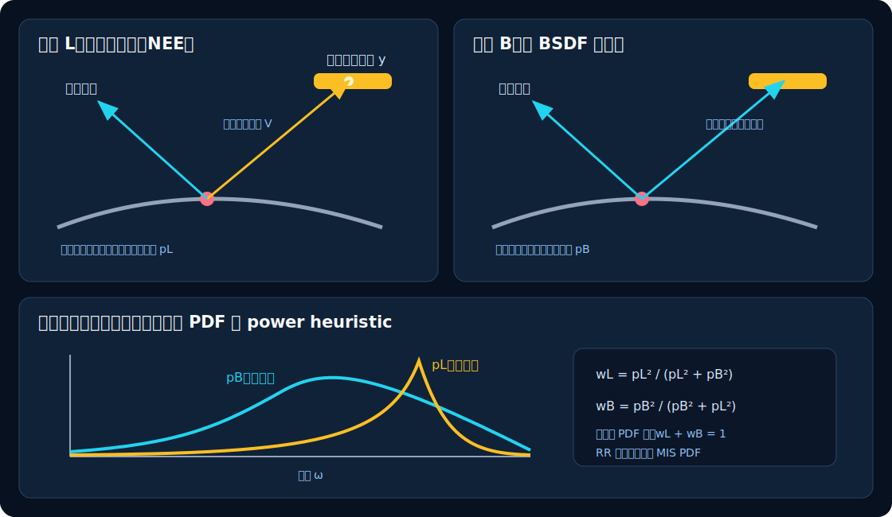

# 05　直接光照、NEE 与 MIS

仅按 BSDF 随机游走在数学上可行，但一盏小灯或 HDR 环境中的高亮区域在表面半球中只占很小方向范围。随机射线可能经过成千上万次尝试也找不到它，画面便出现高方差亮点。SpectralDock 在 Lambert 和 metal 表面主动连接一个有限灯样本，并在存在 HDR 环境时另取一个环境样本；这叫 Next Event Estimation（NEE）。

## 1. 在灯面上取一个随机点

假设第 $i$ 盏显式面积灯以概率 $q_i$ 被选择，再在其面积 $A_i$ 上均匀取点 $\mathbf y$。相对于面积的联合 PDF 是

$$
p_A(\mathbf y)=\frac{q_i}{A_i}.
$$

矩形灯按两条边的均匀坐标取点；圆盘灯用 $r=\sqrt\xi$ 均匀采面积；球灯均匀采整个球面。

渲染方程却是对着色点 $\mathbf x$ 周围的方向积分，所以必须把面积 PDF 换成方向 PDF。令

$$
\boldsymbol\omega_i=\frac{\mathbf y-\mathbf x}{\|\mathbf y-\mathbf x\|},
\qquad
r=\|\mathbf y-\mathbf x\|,
$$

灯面法线为 $\mathbf n_l$，则

$$
p_\omega
=p_A\left|\frac{dA}{d\omega}\right|
=p_A\frac{r^2}{|\mathbf n_l\cdot(-\boldsymbol\omega_i)|}.
$$

代入 $p_A=q_i/A_i$，得到

$$
\boxed{
p_L(\boldsymbol\omega_i)=
\frac{q_i r^2}
{A_i\,|\mathbf n_l\cdot(-\boldsymbol\omega_i)|}
}
$$

这正是第 2 章立体角关系的倒数变换。PDF 中必须保留实际选灯概率 $q_i$；漏掉它会让改变采样分布也改变收敛能量。

例如 $q_i=0.5$、$A_i=4$、$r=3$、灯面余弦为 0.5 时，$p_A=1/8$，而 $dA/d\omega=18$，所以 $p_\omega=2.25\ \mathrm{sr}^{-1}$。距离越远，同一面积覆盖的方向范围越小，单位立体角的概率密度反而越大。

`light_direction_pdf` 逐项实现了这个换元：`distance2` 是 $r^2$，`cos_light` 是灯面余弦，`area` 对应 $A_i$，`selection_pdf` 是从最终 float CDF 反推的 $q_i$。两面灯先对余弦取绝对值；单面灯背面或退化面积直接返回零。

<!-- source-snippet id="light-area-to-solid-angle-pdf" path="src/device_programs.cu" anchor="return light.selection_pdf" -->
```cpp
  const float3 displacement = sub(point, from);
  const float distance2 = length2(displacement);
  const float3 wi = normalize3(displacement);
  const float3 light_normal = light.type == spectraldock::kLightSphere
      ? normalize3(sub(point, light.p0))
      : normalize3(light.normal);
  float cos_light = dot3(light_normal, neg(wi));
  if (light.two_sided != 0) {
    cos_light = fabsf(cos_light);
  }
  const float area =
      light.area > 0.0f ? light.area
                        : length3(cross3(light.edge_u, light.edge_v));
  if (cos_light <= 0.0f || area <= 0.0f) {
    return 0.0f;
  }
  if (!(light.selection_pdf > 0.0f)) return 0.0f;
  return light.selection_pdf * distance2 / (cos_light * area);
}
```

当前场景接口中的显式灯都是单面：rectangle/disk 只从法线正面发光，sphere 只向外发光。设备结构预留了 `two_sided` 分支，但加载器未暴露它。球灯在整个球面均匀取点，背向着色点的样本会被余弦条件拒绝；这是正确但不够高效的选择。

## 2. 二值阴影与跨水面透射

从 $\mathbf x$ 到 $\mathbf y$ 发一条有限长度阴影射线。若中间没有其他几何体，记可见性 $V(\mathbf x,\mathbf y)=1$；被遮挡则为 0。

一份灯光采样的直接光估计为

$$
\widehat{\mathbf L}_{\text{direct}}=
\frac{
V(\mathbf x,\mathbf y)
\,\mathbf L_e(\mathbf y\rightarrow\mathbf x)
\odot f_s(\mathbf x,\boldsymbol\omega_i,\boldsymbol\omega_o)
\,\max(0,\mathbf n\cdot\boldsymbol\omega_i)
}{p_L(\boldsymbol\omega_i)}.
$$

一个公式同时解释了几个常见现象：

- 遮挡让 $V=0$，形成阴影；
- 面积灯上不同点可能部分可见，形成软阴影；
- $r^2$ 出现在 PDF 分母的倒数中，自然产生距离平方衰减；
- 每次只选一盏有限灯，但 $q_i$ 已包含在 PDF 并被权重补偿。

无 `water_surface` 的兼容路径不计算第二个表面的完整材质，只需要判断“是否被挡”，因此把介电质也视作阴影遮挡物；alpha cutoff 可以让被裁掉的纹素不遮挡。含水路径则把二值 $V$ 推广为 RGB 直线透射率：反复取得透明边界的完整命中，每段乘 Beer 吸收、每个界面乘 $1-F$，普通不透明交点仍把贡献归零。它不按 Snell 弯折到灯的连接，因此不是焦散求解；详见[第 12 章第 6 节](12-runtime-analytic-water.md#6-跨水面直接光的工程近似)。

直接光函数的末尾把公式各项接在一起：先从表面沿法线偏移起点，再向灯点发有限阴影射线；不可见时贡献为零。可见时 `direct_light_mis_weight` 给出 $w_L$，返回值依次相乘 $f_s$、$L_e$、$\cos\theta$、$w_L$，最后除以 $p_L$。

<!-- source-snippet id="direct-light-visibility-and-estimator" path="src/device_programs.cu" anchor="surface_transmittance" -->
```cpp
  float3 surface_transmittance = f3(1.0f, 1.0f, 1.0f);
  if (params.water_surface_count == 0u) {
    if (!trace_visible(shadow_origin, shadow_direction, shadow_distance,
                       static_cast<int>(light_index), traced_rays)) {
      return f3(0.0f, 0.0f, 0.0f);
    }
  } else {
    surface_transmittance = trace_water_transmittance(
        shadow_origin, shadow_direction, shadow_distance,
        static_cast<int>(light_index), media, traced_rays, water_counters);
    if (!(max_component(surface_transmittance) > 0.0f)) {
      return f3(0.0f, 0.0f, 0.0f);
    }
  }
  if (track_volume(shadow_origin, shadow_direction, shadow_distance, rng,
                   volume_counters).collided != 0) {
    return f3(0.0f, 0.0f, 0.0f);
  }
  const float mis = direct_light_mis_weight(
      light_pdf, bsdf_pdf, light.geometry_index >= 0,
      next_bsdf_ray_exists);
  return mul(mul(mul(bsdf, light.emission), surface_transmittance),
             no_l * mis / light_pdf);
```

无水分支的 `trace_visible` 把 `tmax` 设在灯点之前，并同时启用“首个命中即终止”和“禁用 closest-hit”，所以只返回二值表面可见性。含水分支的 `trace_water_transmittance` 改用有限距离 radiance 查询取得 `SurfaceHit`，最多穿过八个透明边界；两条分支之后的 `track_volume` 再估计火焰吸收。水体近似见第 12 章，完整 flame 体积推导见第 11 章。

<!-- source-snippet id="shadow-ray-visibility-query" path="src/device_programs.cu" anchor="OPTIX_RAY_FLAG_TERMINATE_ON_FIRST_HIT" -->
```cpp
static __forceinline__ __device__ bool trace_visible(
    float3 origin, float3 direction, float distance, int light_index,
    unsigned long long& traced_rays) {
  unsigned int visible = 0u;
  unsigned int target_light = static_cast<unsigned int>(light_index);
  ++traced_rays;
  optixTrace(params.traversable, origin, direction, params.scene_epsilon,
             fmaxf(distance - params.scene_epsilon, params.scene_epsilon),
             0.0f, OptixVisibilityMask(255),
             OPTIX_RAY_FLAG_TERMINATE_ON_FIRST_HIT |
                 OPTIX_RAY_FLAG_DISABLE_CLOSESTHIT,
             spectraldock::kRayShadow, spectraldock::kRayTypeCount,
             spectraldock::kRayShadow, visible, target_light);
  return visible != 0u;
}
```

## 3. 为什么需要两种采样策略

NEE 擅长寻找小而亮的灯，BSDF 采样擅长寻找尖锐材质瓣：

- 粗糙漫反射面对小灯：灯光采样通常更好；
- 很光滑的 GGX 表面：BSDF 采样容易找到高光方向；
- 完美介电反射/折射：只有 delta 方向有贡献，普通面积灯方向采样无法匹配它。

同一条“当前表面到灯”的路径，可能由两种策略生成：

1. NEE 先选灯面点并连接过去；
2. BSDF 先选方向，后续射线恰好命中那个灯面。

若简单把两份完整估计相加，同一路径会被重复计算。Multiple Importance Sampling（MIS）用权重把贡献在两种策略间分配。



*图 4：上方是两种方式生成同一类光路；下方示意两种 PDF 在不同方向上各有优势。*

## 4. Power heuristic

设灯光方向 PDF 为 $p_L$，BSDF 方向 PDF 为 $p_B$。当前实现每种策略各用一个样本，采用指数为 2 的 power heuristic：

$$
w_L=\frac{p_L^2}{p_L^2+p_B^2},
\qquad
w_B=\frac{p_B^2}{p_B^2+p_L^2}.
$$

当 $p_L,p_B$ 至少一个为正，且两侧使用同一对 PDF 时，$w_L+w_B=1$。恰好一个 PDF 为零时，可生成该路径的策略权重为 1，另一策略为 0。两者都为零时，`power_heuristic` 返回 0；这个结果不参与有效贡献，因为调用点会先拒绝无效样本，例如 NEE 在 `bsdf_pdf <= 0` 时直接返回。更擅长生成该方向的策略得到更大权重，但另一策略并不会被硬切断。实现会先用 $\max(p_L,p_B)$ 归一化两项再平方；这不改变正 PDF 下的公式，却避免大 PDF 平方溢出、小 PDF 平方同时下溢，或人为截断分母破坏互补性。

源码先用较大 PDF 作为 `scale`。两个 PDF 至少一个为正时，归一化后的 `a`、`b` 至少有一个为 1，二者平方后仍保留原比值；前两个提前返回分别覆盖待求权重的 PDF 非正，以及竞争 PDF 非正的情况。

<!-- source-snippet id="stable-power-heuristic" path="src/device_programs.cu" anchor="float power_heuristic" -->
```cpp
static __forceinline__ __device__ float power_heuristic(
    float pdf_a, float pdf_b) {
  if (!(pdf_a > 0.0f)) return 0.0f;
  if (!(pdf_b > 0.0f)) return 1.0f;
  const float scale = pdf_a > pdf_b ? pdf_a : pdf_b;
  const float a = pdf_a / scale;
  const float b = pdf_b / scale;
  const float aa = a * a;
  const float bb = b * b;
  return aa / (aa + bb);
}
```

- 有限灯与环境 NEE 项各自乘对应的 $w_L$；
- BSDF 路径稍后命中绑定几何的 emitter 时乘 $w_B$；
- 两个 PDF 都以当前着色点的**方向测度**表示，才能放进同一公式。

例如 $p_L=0.8$、$p_B=0.2$ 时

$$
w_L=\frac{0.64}{0.64+0.04}\approx0.941,
\qquad
w_B\approx0.059.
$$

这并不是说 94.1% 的光来自灯光采样，而是说在该方向上，灯光策略的估计通常更可靠。

## 5. Delta 与不能被另一策略生成的路径

MIS 只应比较两种策略都可能生成的路径：

- 上一事件是光滑介电 delta 时，普通 NEE 不可能生成精确的反射/折射方向，命中 emitter 的权重保持 1；
- 没有可命中几何的解析面积灯只能由 NEE 得到，NEE 权重为 1；
- 发光几何没有绑定到显式灯时，`light_direction_pdf` 为 0，路径命中贡献也保持完整权重；
- 在最后一个 `max_depth` 表面事件，没有下一条 BSDF 射线参与竞争，即使灯绑定了几何，NEE 权重也为 1。

两个设备局部策略函数把这些边界写成布尔条件。NEE 只有在灯可被后继射线命中且下一条 BSDF 射线确实存在时才竞争；emitter-hit 则在前驱为 delta 或 emitter 未绑定显式灯时保留完整贡献。

<!-- source-snippet id="mis-competing-strategy-policy" path="src/device_programs.cu" anchor="direct_light_mis_weight" -->
```cpp
static __forceinline__ __device__ float direct_light_mis_weight(
    float light_pdf, float bsdf_pdf, bool light_can_be_hit,
    bool next_bsdf_ray_exists) {
  return light_can_be_hit && next_bsdf_ray_exists
             ? power_heuristic(light_pdf, bsdf_pdf)
             : 1.0f;
}

static __forceinline__ __device__ float emitter_hit_mis_weight(
    float bsdf_pdf, float light_pdf, bool previous_event_was_delta,
    bool emitter_is_bound_to_light) {
  return previous_event_was_delta || !emitter_is_bound_to_light
             ? 1.0f
             : power_heuristic(bsdf_pdf, light_pdf);
}
```

## 6. 统一的 RR/MIS PDF 约定与末端深度

SpectralDock 采用“RR 独立于 MIS”的约定。局部方向采样得到的 $p_B$ 原样保存到 `previous_pdf`，不乘俄罗斯轮盘生存率 $s$。轮盘只对路径吞吐量进行期望补偿：

$$
\boldsymbol\beta\leftarrow\frac{\boldsymbol\beta}{s},
\qquad
p_{\mathrm{prev}}=p_B.
$$

这样，NEE 在当前顶点计算 $w_L$，以及幸存 BSDF 路径稍后命中 emitter 时计算 $w_B$，始终使用相同的原始 $p_L,p_B$，互补关系不随 RR 改变。

末端深度按“策略是否真实存在”处理：最后一个允许的表面事件仍执行完整 NEE，但因为不会追踪下一条 BSDF 射线，直接光权重为 1；累积直接光后立即结束，不再消耗 BSDF 或 RR 随机数。相机直接命中、delta 前驱、未绑定灯和末端 NEE 都由设备局部策略函数返回完整权重。

## 7. 当前直接光采样的边界

[`sample_finite_direct_light`](../../src/device_programs.cu) 与 [`sample_environment_direct_light`](../../src/device_programs.cu) 只在 Lambert 和 metal 表面执行。介电质是 delta BSDF，通过继续路径寻找灯光。

有限灯 NEE 支持 rectangle、disk、sphere 面积灯和程序化 flame，HDR environment 则通过独立的无限远 NEE 域采样。以下光源仍不被主动采样：

- constant、sky 渐变和太阳瓣；
- mesh emitter；
- 任何绑定纹理的 emitter。

它们仍可由 BSDF 路径命中或 miss 得到，因此不是必然缺失，但小而亮时可能有很高方差。v5 默认按亮度与面积/体积代理选择有限灯，并按亮度乘 texel 立体角选择 HDR 环境方向；`uniform` 只作为正确性与方差对照。完整构造见[第 13 章](13-hdr-environment-and-importance-sampling.md)。

## 8. 对应实现

设备端采样与 RR/MIS 决策都实现在 [`src/device_programs.cu`](../../src/device_programs.cu)。相关 helper 位于该文件的匿名命名空间，与调用点一起编译为 OptiX IR；不存在需要同步维护的 CPU 渲染副本：

- `sample_light_surface`：矩形、圆盘和球面的面积采样；
- `light_direction_pdf`：面积 PDF 到方向 PDF 的换元；
- `trace_visible`：有限距离阴影射线；
- `sample_finite_direct_light`：有限灯 NEE、BSDF 评估和 $w_L$；
- `sample_environment_direct_light`：无限远环境 NEE、透射和 $w_L$；
- raygen 调用点：把两个独立 NEE 域的估计相加；
- `power_heuristic`：数值稳定的平方权重；
- `resolve_continuation`：RR 存活、吞吐量补偿和原始 BSDF PDF；
- `direct_light_mis_weight`、`emitter_hit_mis_weight`：只有竞争策略真实存在时才使用 MIS；
- `__raygen__pathtrace` 的 emitter 分支：使用上一次 `previous_pdf` 计算 $w_B$。

下一章转向另一个基础问题：GPU 怎样快速回答数百万次“最近命中了哪个表面？”

[上一章：Monte Carlo 路径追踪](04-monte-carlo-path-tracing.md) · [返回目录](README.md) · [下一章：几何、可见性与 BVH](06-geometry-visibility-and-bvh.md)
