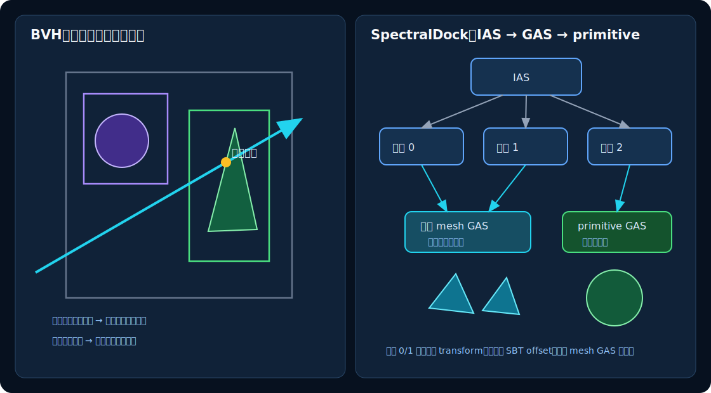

# 06　几何、可见性与 BVH

路径积分器反复提出两个几何问题：

1. 从 $\mathbf o$ 沿 $\mathbf d$ 前进，最先遇到哪个表面？
2. 从当前点到灯面点之间，是否有任何遮挡？

两者都从射线方程 $\mathbf r(t)=\mathbf o+t\mathbf d$ 出发；差别只是前者需要最近交点的完整信息，后者遇到第一个遮挡即可停止。

## 1. 解析几何求交

### 1.1 球

中心为 $\mathbf c$、半径为 $R$ 的球满足

$$
\|\mathbf p-\mathbf c\|^2=R^2.
$$

代入 $\mathbf p=\mathbf o+t\mathbf d$ 得到关于 $t$ 的二次方程：

$$
(\mathbf d\cdot\mathbf d)t^2
+2\mathbf d\cdot(\mathbf o-\mathbf c)t
+\|\mathbf o-\mathbf c\|^2-R^2=0.
$$

判别式小于零表示错过球；等于零表示相切；大于零有两个交点。选择有效范围内最小的正根。普通路径使用 OptiX 内建 sphere primitive 完成遍历和求交；含 `water_surface` 场景的 dielectric sphere 为了保留球内射线的背面退出命中，改用自定义实心 sphere，详见[第 12 章](12-runtime-analytic-water.md#水中-dielectric-sphere-为什么使用自定义实心边界)。

球面外法线为

$$
\mathbf n_g=\frac{\mathbf p-\mathbf c}{R}.
$$

### 1.2 平面、圆盘与矩形

经过 $\mathbf p_0$、法线为 $\mathbf n$ 的平面满足

$$
\mathbf n\cdot(\mathbf p-\mathbf p_0)=0.
$$

射线交点参数为

$$
t=\frac{\mathbf n\cdot(\mathbf p_0-\mathbf o)}
{\mathbf n\cdot\mathbf d}.
$$

分母接近零时射线与平面平行。圆盘还要求 $\|\mathbf r(t)-\mathbf p_0\|\le R$。rectangle 在主机端拆成两个三角形交给 OptiX 内建三角形求交；需要镂空轮廓时，同一种几何再通过 `alpha_texture` 和 any-hit 裁剪。Python API 中的 rectangle 实际允许任意非退化平行四边形，并不额外校验四个角为直角；rectangle light 也只要求两条边不共线。

### 1.3 圆柱

设圆柱轴单位向量为 $\mathbf a$，底部参考点为 $\mathbf p_0$。对任意向量 $\mathbf q$，去掉沿轴分量：

$$
\mathbf q_\perp=\mathbf q-(\mathbf q\cdot\mathbf a)\mathbf a.
$$

圆柱侧面满足

$$
\|\mathbf q_\perp\|^2=R^2.
$$

把射线代入后仍是二次方程。

有限高度圆柱还要检查

$$
0\le(\mathbf r(t)-\mathbf p_0)\cdot\mathbf a\le H.
$$

`d_perp` 与 `q_perp` 正是 $\mathbf d_\perp$ 和 $\mathbf q_\perp$；随后三行 `a`、`b`、`c` 构造侧壁二次方程。typed SceneBuilder 要求 cylinder 的 `height > 0`，所以合法 API 输入总是进入有限圆柱分支；`height <= 0` 时调用共享求根器只是防御性路径。

<!-- source-snippet id="cylinder-quadratic-coefficients" path="src/device_programs.cu" anchor="__intersection__cylinder" -->
```cpp
extern "C" __global__ void __intersection__cylinder() {
  const HitgroupData* record =
      reinterpret_cast<const HitgroupData*>(optixGetSbtDataPointer());
  const GeometryData& geometry = record->geometry;
  const float3 origin = optixGetObjectRayOrigin();
  const float3 direction = optixGetObjectRayDirection();
  const float3 axis = normalize3(geometry.p1);
  const float3 q = sub(origin, geometry.p0);
  const float3 d_perp = sub(direction, mul(axis, dot3(direction, axis)));
  const float3 q_perp = sub(q, mul(axis, dot3(q, axis)));
  const float a = dot3(d_perp, d_perp);
  const float b = 2.0f * dot3(d_perp, q_perp);
  const float c =
      dot3(q_perp, q_perp) - geometry.radius * geometry.radius;
```

有限圆柱实际使用普通二次公式计算两个根，再按从近到远排列。`valid_t` 检查当前 OptiX 射线区间，`s` 对应轴向坐标；只有 $s\in[0,H]$ 且位于构建时 AABB 内的根才会报告。

<!-- source-snippet id="finite-cylinder-root-filter" path="src/device_programs.cu" anchor="const float roots[2]" -->
```cpp
  const float root = sqrtf(discriminant);
  float t0 = (-b - root) / (2.0f * a);
  float t1 = (-b + root) / (2.0f * a);
  if (t1 < t0) {
    const float temp = t0;
    t0 = t1;
    t1 = temp;
  }
  const float roots[2] = {t0, t1};
  for (int i = 0; i < 2; ++i) {
    const float t = roots[i];
    if (!valid_t(t)) {
      continue;
    }
    const float3 point = add(origin, mul(direction, t));
    const float s = dot3(sub(point, geometry.p0), axis);
    if (s >= 0.0f && s <= geometry.height && inside_aabb(point, geometry) &&
        optixReportIntersection(t, 0u)) {
      return;
    }
  }
}
```

当前 cylinder **只有侧壁，没有上下端盖**。若需要封闭物体，场景必须另外添加圆盘。

### 1.4 抛物柱面

场景中的 `parabola` 不是旋转抛物面，而是沿一根轴延伸的**抛物柱面**。在局部截面坐标 $(x,y)$ 中，它满足

$$
x^2=4fy,
$$

其中 $f$ 是顶点到焦点的距离。射线的局部 $x(t),y(t)$ 都是 $t$ 的一次式，代入后得到二次方程。`__intersection__parabola` 把系数交给共享的 `report_quadratic`；这个 helper 也是上述 `height <= 0` cylinder 防御性路径所调用的求根器，但合法 API 输入中的有限圆柱不经过它。

`report_quadratic` 避免直接计算两个 $(-b\pm\sqrt\Delta)/(2a)$，而是构造

$$
q=-\frac12\left(b+\mathrm{copysign}(\sqrt\Delta,b)\right),
\qquad t_0=\frac qa,\quad t_1=\frac cq.
$$

这种写法让其中一个根避免两个接近数相减，另一个根再由韦达关系得到。共享函数在这段代码之前先处理退化的一次方程；下面的片段处理无实根、重根和从近到远报告交点。

<!-- source-snippet id="stable-quadratic-roots" path="src/device_programs.cu" anchor="const float q = -0.5f" -->
```cpp
  const float discriminant = b * b - 4.0f * a * c;
  if (discriminant < 0.0f) {
    return;
  }
  const float root = sqrtf(discriminant);
  const float q = -0.5f * (b + copysignf(root, b));
  float t0;
  float t1;
  if (fabsf(q) > 1.0e-20f) {
    t0 = q / a;
    t1 = c / q;
  } else {
    t0 = -b / (2.0f * a);
    t1 = t0;
  }
  if (t1 < t0) {
    const float temp = t0;
    t0 = t1;
    t1 = temp;
  }
  if (!report_root(t0, geometry) && t1 > t0 + 1.0e-7f) {
    report_root(t1, geometry);
  }
}
```

`report_root` 还要求最终交点位于用户给定的 AABB 内，因此实际几何是被包围盒裁剪的一段抛物柱面。

圆盘、圆柱和抛物柱面的自定义求交分别位于 [`__intersection__disk`、`__intersection__cylinder`、`__intersection__parabola`](../../src/device_programs.cu)。

## 2. 三角形、重心坐标与 OBJ

三角形顶点为 $\mathbf a,\mathbf b,\mathbf c$。内部任一点可写成

$$
\mathbf p=\lambda_a\mathbf a+
\lambda_b\mathbf b+
\lambda_c\mathbf c,
$$

$$
\lambda_a+\lambda_b+\lambda_c=1,
\qquad
\lambda_a,\lambda_b,\lambda_c\ge0.
$$

这三个 $\lambda$ 是重心坐标。除判断交点外，它还能插值顶点属性：

$$
\mathbf n_s=\mathrm{normalize}
(\lambda_a\mathbf n_a+\lambda_b\mathbf n_b+\lambda_c\mathbf n_c),
$$

$$
\mathbf{uv}=\lambda_a\mathbf{uv}_a+\lambda_b\mathbf{uv}_b+\lambda_c\mathbf{uv}_c.
$$

OBJ 导入器会三角化多边形、合并 group，并处理 OBJ 独立的 position/normal/UV 索引。省略 `materials` 或传入空 mapping 时是 legacy 模式：加载器不读取 `mtllib`/`usemtl`，最终材质、纹理和正反面由 Python 程序传给 mesh object 的 typed handles 决定。只有非空 `materials` 才启用严格多材质模式：加载器读取 sibling MTL，把每个输出三角形的 `usemtl` 槽 $s_t$ 通过调用者给出的映射 $B$ 转成全局材质 ID

$$
m_t=B(s_t),\qquad 0\le t<N_\triangle.
$$

映射键必须与 OBJ 实际使用的槽集合精确一致；每个三角形都必须解析到 MTL 中的有效命名材质，缺少绑定和多余绑定都会失败。实现把严格检查得到的材质 ID 按三角形顺序写入 mesh resource：

<!-- source-snippet id="obj-usemtl-material-binding" path="src/scene_builder.cpp" anchor="for (const std::string& slot : triangle_slots)" -->
```cpp
    std::unordered_set<std::string> used_slots;
    resource.material_ids.reserve(triangle_slots.size());
    for (const std::string& slot : triangle_slots) {
      const auto binding = bindings.find(slot);
      if (binding == bindings.end())
        fail(where + ".material_bindings",
             "missing binding for used OBJ material slot '" + slot + "'");
      used_slots.insert(slot);
      resource.material_ids.push_back(binding->second);
    }
    for (const auto& [slot, material_id] : bindings) {
      (void)material_id;
      if (used_slots.count(slot) == 0)
        fail(where + ".material_bindings",
             "binding for unused OBJ material slot '" + slot + "'");
```

MTL 在这里仅建立 `usemtl` 名称解析关系；`Kd`、`map_Kd`、`illum`、材质名和其他字段不会自动创建纹理或推断 BSDF，Python typed handle 始终是材质定义。若法线不完整，导入器按 smoothing group 生成法线；任何已绑定材质或 object-wide alpha 使用纹理时，UV 必须完整。

导入器会丢弃“至少两个 corner 解析到完全相同 position”的零面积面，因为它们
没有可求交面积，常见于建模工具导出的圆形极点；若三个 position 不同但仍共线
或面积低于安全阈值，则继续作为退化输入报错。材质 ID 数组只为保留下来的输出
三角形追加条目，因此始终与 GAS primitive index 一一对应。

## 3. 几何法线、着色法线和正反面

**几何法线**由真实表面形状决定，用来判断射线命中正面还是背面。**着色法线**可由网格顶点法线插值得到，让低多边形表面看起来平滑。

SpectralDock 先确保着色法线与几何外法线位于同一半球，再根据当前射线来自正面还是背面，把最终 `hit.normal` 朝向射线一侧。这样 `wo = -ray_direction` 与法线满足正点积。legacy mesh 仍用真实几何法线选择 object-wide 的 `front_material` 或 `back_material`；严格映射 mesh 则让一个三角形的正反面都使用同一个槽材质。

着色法线只改变光照方向，不改变真实轮廓和求交位置；极端插值法线仍可能不完全满足严格的能量守恒校正。

## 4. UV、纹理与 alpha cutoff

UV 把三维表面点映射到二维纹理。球、圆盘、圆柱和抛物柱面有解析映射；三角网格用重心插值。设备采样图像时执行一次纵向坐标转换，以适配 PNG 顶部原点。

`alpha_cutoff` 是确定性二值测试：

$$
\alpha<\text{cutoff}
\quad\Longrightarrow\quad
\text{忽略本次交点}.
$$

它适合叶片、纸片镂空等效果，但不是半透明混合。通过测试的纹素完全存在，未通过的完全不存在；相机射线和阴影射线使用同样的裁剪逻辑。

## 5. 为什么需要 BVH

若场景有 $M$ 个三角形、总共追踪 $R$ 条射线，逐射线测试所有三角形需要约 $R\times M$ 次求交。BVH（Bounding Volume Hierarchy）用便宜的轴对齐包围盒测试排除大片几何：

1. 根节点包住整个场景；
2. 子节点包住更小的几何集合；
3. 射线错过一个盒子，就跳过其全部后代；
4. 只有命中叶节点盒子时，才测试实际 primitive。



*图 5：左侧展示 BVH 如何跳过未命中的整组几何；右侧展示 SpectralDock 的两级 OptiX 加速结构。*

BVH 不改变求交答案，只改变寻找答案的工作量。最坏情况仍可能很差，但典型场景会比线性遍历少测试大量 primitive。

## 6. SpectralDock 的 GAS 与 IAS

OptiX 把底层几何加速结构称为 GAS，把实例层称为 IAS：

- 每个被引用的 mesh 资源上传并构建一份 GAS；严格映射资源还上传一份逐三角形材质 ID 缓冲；若紧凑尺寸确实更小则压缩，多个对象实例共享最终结构与材质表；
- 每个非 mesh primitive 对象各构建一份 GAS；
- IAS 为 typed SceneBuilder 注册的每个对象保存一个实例，并指向相应 GAS；
- 只有 mesh 对象支持 `T * Rz * Ry * Rx * S` 实例变换；缩放三分量必须严格大于零，不能用负缩放做镜像；其他 primitive 已在世界坐标中定义。

完整的数据链为：CPU 侧 `TriangleMesh` 数组与可选逐三角形材质 ID 上传到 CUDA `DeviceBuffer`，position/index 设备指针写入 `OptixBuildInput` 并构建 GAS；每个场景对象再把对应 GAS handle 写入 `OptixInstance`，实例数组上传后作为另一份 `OptixBuildInput` 构建 IAS。最终 `LaunchParams.traversable` 指向 IAS，射线遍历先经过实例层，再进入相应 GAS；材质 ID 缓冲不参与 BVH 构建，只在命中着色时按 primitive index 查询。

### 6.1 从 CPU mesh 到三角形 GAS

`build_mesh` 分配并上传 position、normal、index、可选 UV 和可选逐三角形材质 ID。OptiX 的三角形遍历只需要 position 与 index，因此它们的设备指针进入 `triangleArray`；normal、UV 与材质 ID 保留在独立 CUDA buffer 中，随后通过第 7 章介绍的 hitgroup SBT data 供着色程序读取。

<!-- source-snippet id="optix-mesh-upload-build-input" path="src/optix_renderer.cpp" anchor="OptixBuildInput input{}" -->
```cpp
  MeshGpu result;
  result.positions.allocate(tracker, mesh.positions.size() * sizeof(Vec3));
  result.normals.allocate(tracker, mesh.normals.size() * sizeof(Vec3));
  result.indices.allocate(tracker, mesh.indices.size() * sizeof(MeshTriangle));
  if (!mesh.texcoords.empty())
    result.texcoords.allocate(tracker, mesh.texcoords.size() * sizeof(Vec2));
  if (!resource.material_ids.empty())
    result.material_ids.allocate(
        tracker, checked_product(resource.material_ids.size(),
                                 sizeof(std::int32_t), "mesh material ids"));
  result.positions.upload(mesh.positions, stream);
  result.normals.upload(mesh.normals, stream);
  result.indices.upload(mesh.indices, stream);
  if (!mesh.texcoords.empty()) result.texcoords.upload(mesh.texcoords, stream);
  if (!resource.material_ids.empty())
    result.material_ids.upload(resource.material_ids, stream);

  unsigned int flag = OPTIX_GEOMETRY_FLAG_NONE;
  CUdeviceptr vertex_pointer = result.positions.pointer();
  OptixBuildInput input{};
  input.type = OPTIX_BUILD_INPUT_TYPE_TRIANGLES;
  input.triangleArray.vertexBuffers = &vertex_pointer;
  input.triangleArray.numVertices =
      checked_u32(mesh.positions.size(), "mesh vertex count");
```

紧随片段之后，代码还设置 vertex/index 格式与 stride、geometry flag、`numSbtRecords = 1` 和无变换格式，再把完整输入交给 `compact_gas`。十个材质槽不会产生十份 GAS 或十条 SBT records；它们只增加一份与 triangle 数量相同的整数缓冲。mesh 的变换不烘焙进 GAS，而是在 IAS 实例上设置，所以同一份几何可以被不同对象复用。

closest-hit 取得 OptiX primitive index 后查询这份缓冲；若 resource 没有映射表，才退回 object-wide 正反面材质：

<!-- source-snippet id="mesh-primitive-material-selection" path="src/device_programs.cu" anchor="return mesh.material_ids[primitive];" -->
```cpp
static __forceinline__ __device__ int hit_material(
    const HitgroupData& hitgroup, bool front_face) {
  const spectraldock::DeviceMeshData& mesh = hitgroup.mesh;
  unsigned int primitive = 0u;
  if ((mesh.flags & spectraldock::kMeshHasMaterials) != 0u &&
      mesh.material_ids != nullptr &&
      mesh_primitive_index(hitgroup, primitive) &&
      primitive < mesh.material_id_count) {
    return mesh.material_ids[primitive];
  }
  return front_face ? hitgroup.geometry.material_front
                    : hitgroup.geometry.material_back;
```

映射表只保存一个材质 ID，因此 mapped triangle 的正反面材质相同；alpha texture 与 cutoff 仍来自 object SBT data，对整个实例生效。

### 6.2 GAS 的复用与条件压缩

构建标志使用 `ALLOW_COMPACTION | PREFER_FAST_TRACE`。前者允许在紧凑尺寸确实更小时减少最终 GAS 占用；快速追踪偏好适合“一次构建后发射大量射线”的离线渲染。

mesh GAS 的所有权按资源而不是对象实例划分。`mesh_gpu_indices` 是资源 ID 到已构建 GPU 结构的缓存：遇到同一 resource 的后续实例时直接 `continue`，所以每份被引用 mesh 只上传、构建一次，再由多个 IAS 实例引用；严格映射的逐三角形材质表也属于 resource 并被这些实例共享。要让同一个 OBJ 使用另一套槽映射，调用者必须创建另一个 mesh resource，它会拥有另一张材质表和另一份 GAS。构建结果只有在紧凑尺寸确实更小时才压缩。

<!-- source-snippet id="mesh-gas-resource-reuse" path="src/optix_renderer.cpp" anchor="for (const Object& object : scene.objects)" -->
```cpp
    for (const Object& object : scene.objects) {
      if (object.type != GeometryType::Mesh) continue;
      const auto& instance = std::get<MeshInstanceData>(object.geometry);
      if (instance.mesh_id < 0 ||
          static_cast<std::size_t>(instance.mesh_id) >= scene.meshes.size())
        throw std::runtime_error("mesh object has an invalid resource id: " + object.name);
      std::int32_t& gpu_index = mesh_gpu_indices[instance.mesh_id];
      if (gpu_index >= 0) continue;
      gpu_index = static_cast<std::int32_t>(mesh_gpus.size());
      const MeshResource& resource = scene.meshes[instance.mesh_id];
      mesh_triangle_count += resource.mesh.indices.size();
      mesh_gpus.push_back(build_mesh(
          optix.context, stream, resource, scene.materials.size(), tracker));
      ++unique_mesh_count;
    }
```

OptiX 先返回建议的 `compact_size`。只有该值非零且严格小于原输出缓冲区时才分配紧凑缓冲区并调用 `optixAccelCompact`；否则直接保留原 GAS，避免“压缩”反而增加或不减少占用。

<!-- source-snippet id="conditional-gas-compaction" path="src/optix_renderer.cpp" anchor="compact_size < output.size()" -->
```cpp
  std::uint64_t compact_size=0; size_device.download(&compact_size,sizeof(compact_size),stream);
  check_cuda(cudaStreamSynchronize(stream),"cudaStreamSynchronize(GAS)");
  temp.reset(); size_device.reset();
  if (compact_size && compact_size < output.size()) {
    DeviceBuffer compact(tracker,compact_size); OptixTraversableHandle compact_handle=0;
    check_optix(optixAccelCompact(context,stream,handle,compact.pointer(),compact.size(),
                                  &compact_handle),"optixAccelCompact");
    check_cuda(cudaStreamSynchronize(stream),"cudaStreamSynchronize(compact)");
    return {std::move(compact),compact_handle};
  }
  return {std::move(output),handle};
}
```

### 6.3 从 GAS handle 到 IAS 与 SBT

主机端的 `instance_handles` 与 `scene.objects` 顺序一致：mesh 对象放入其共享 GAS handle，其他 primitive 放入各自 GAS handle。`build_ias` 为每个对象建立 `OptixInstance`；此前的代码把 mesh 的实例变换写入 `transform`，非 mesh primitive 则使用单位变换。

<!-- source-snippet id="optix-ias-instance-binding" path="src/optix_renderer.cpp" anchor="instance.sbtOffset =" -->
```cpp
    instance.instanceId = checked_u32(i, "instance id");
    instance.sbtOffset =
        checked_u32(i * kRayTypeCount, "instance SBT offset");
    instance.visibilityMask = 255;
    instance.flags = OPTIX_INSTANCE_FLAG_NONE;
    instance.traversableHandle = handles[i];
  }
  DeviceBuffer instance_buffer(
      tracker, instances.size() * sizeof(OptixInstance));
  instance_buffer.upload(instances, stream);
  CUdeviceptr instances_pointer = instance_buffer.pointer();
  OptixBuildInput input{};
  input.type = OPTIX_BUILD_INPUT_TYPE_INSTANCES;
  input.instanceArray.instances = instances_pointer;
  input.instanceArray.numInstances =
      checked_u32(instances.size(), "instance count");
  return compact_gas(context, stream, input, tracker);
```

三个字段承担不同职责：`traversableHandle` 决定实例进入哪一份 GAS；`instanceId` 保留对象序号作为 OptiX 可查询的语义 ID，当前设备着色路径并不依赖它选取 record；`sbtOffset` 才负责连接第 7 章的 hitgroup SBT。项目令 `kRayTypeCount = 2`，而 `optixTrace` 把 radiance 或 shadow 的 ray type 作为 record 偏移，因此最终命中记录索引为

$$
\text{hit record}=i\times 2+\text{ray type}.
$$

于是共享同一 GAS handle 的两个 mesh 实例仍可拥有各自的 IAS transform，并落到不同对象的 SBT records。legacy resource 可由各 record 取得实例自己的正反面材质；严格映射 resource 的材质则来自共享的逐三角形表，record 仍提供 object-wide alpha、几何数据和灯索引。上传后的 `OptixInstance` 数组作为实例型构建输入，经同一 `compact_gas` 路径生成最终 IAS。

## 7. 两类射线的不同答案

| 射线类型 | 需要的结果 | OptiX 行为 |
|---|---|---|
| radiance | 最近交点的位置、法线、UV、材质和灯索引 | 执行 closest-hit，未命中执行 radiance miss |
| shadow | 到指定距离是否无阻挡 | 首个有效遮挡即终止，不执行 closest-hit |

自交偏移和有限的阴影 `tmax` 都是必要的数值边界。但固定世界尺度的 `scene_epsilon = 1e-4` 不是尺度自适应方案：场景极大或极小时，可能需要更精细的误差处理。

下一章将把路径状态、BVH 和材质程序接到 OptiX 的 GPU 执行模型中。

[上一章：直接光照、NEE 与 MIS](05-direct-lighting-and-mis.md) · [返回目录](README.md) · [下一章：OptiX/GPU 实现](07-optix-gpu-implementation.md)
