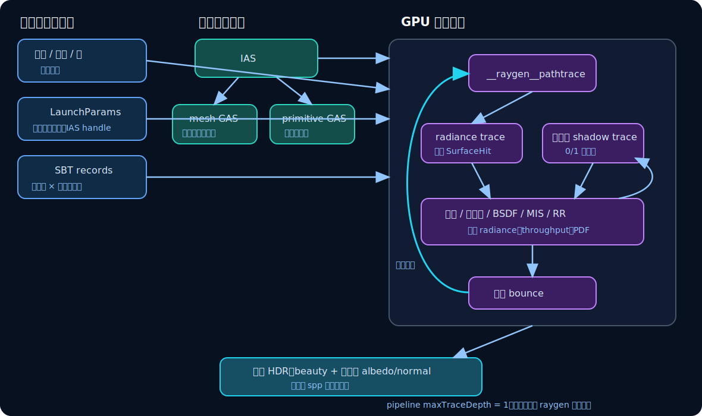

# 07　OptiX/GPU 实现

前六章已经给出渲染器的数学和算法。本章只做一件事：把这些概念映射到 SpectralDock 的实际 GPU 数据流。理解本章不需要 CUDA 编程经验；可先把 GPU 看成能够同时运行大量轻量任务的处理器。

## 1. 一次渲染的主机端生命周期

[`render_optix`](../../src/optix_renderer.cpp) 把一次渲染作为单帧事务执行：

~~~mermaid
flowchart TD
    A["解析完成的 Scene 与 RenderSettings"] --> B["初始化 CUDA device 0、stream 和 OptiX context"]
    B --> C["加载 OptiX IR，创建 module、program groups、pipeline"]
    C --> D["解码并上传纹理、材质和显式灯"]
    D --> E["上传 mesh；构建并压缩 GAS/IAS"]
    E --> F["构造 SBT 与 LaunchParams"]
    F --> G["optixLaunch：每像素执行路径积分"]
    G --> H{"denoise?"}
    H -->|是| I["OptiX HDR denoiser"]
    H -->|否| J["保留原始 beauty"]
    I --> K["CUDA 后处理"]
    J --> K
    K --> L["RGBA8 下载到主机并生成统计"]
~~~

当前每次调用都会重新创建管线和场景资源，没有跨帧缓存；它面向命令行离线渲染，而非持续交互式窗口。设备固定选择 CUDA device 0。

*图 6：IAS/GAS 负责“可能命中什么”，SBT 负责“命中后使用哪份数据和程序”，raygen 负责整个路径循环。*

## 2. OptiX 程序类型对应什么职责

设备代码先单独编译为 OptiX IR，再由主程序创建 module。当前 pipeline 有 15 个 program group：

| 类型 | 数量 | 本项目职责 |
|---|---:|---|
| ray-generation | 1 | `__raygen__pathtrace`：每个像素的 spp 与路径反弹循环 |
| miss | 2 | radiance miss 只报告“未命中”，由 raygen 评估背景；shadow miss 返回“可见” |
| hitgroup | 12 | 6 类 primitive × 2 类射线，各自组合 intersection/any-hit/closest-hit |

六类内部 primitive 是 sphere、triangle、disk、cylinder、parabola、mesh。rectangle 和 sketch 在构建时都变成 triangle；mesh 也使用内建三角形求交，但有不同的数据访问路径。

Hitgroup 可包含三种阶段：

- **intersection**：自定义几何计算候选 \(t\)；sphere/triangle 使用 OptiX 内建阶段；
- **any-hit**：每个候选交点都可执行，用于 alpha cutoff 和阴影目标灯的特殊忽略；
- **closest-hit**：遍历结束后处理最近有效交点，生成位置、法线、UV、材质与灯索引。

## 3. 数学递归不等于 GPU 调用递归

管线链接参数明确设置

~~~cpp
link.maxTraceDepth = 1;
~~~

这表示一次 `optixTrace` 不会从 closest-hit 再递归调用下一条辐射射线。完整路径由 `__raygen__pathtrace` 自己迭代：

~~~text
raygen
  ├─ optixTrace(radiance) → 得到一个 SurfaceHit
  ├─ 可能 optixTrace(shadow) → 得到一个可见性布尔值
  ├─ 更新 radiance / throughput / PDF
  └─ 改写 ray_origin 与 ray_direction，进入下一次 bounce
~~~

这样 GPU 调用栈保持很浅，路径状态清楚地留在 raygen 局部变量中。报告中所说“渲染方程递归”是数学依赖关系，不应误写成实现使用递归函数。

## 4. 一个 GPU 工作项处理一个像素

`optixLaunch` 的维度为 `width × height × 1`。每个 raygen invocation 负责一个像素，并在内部串行循环 `spp` 条样本路径。不同像素同时在 GPU 上执行。

这种映射的优点是每个像素只需在末尾写一次平均后的 beauty/albedo/normal。代价是不同路径长度、不同材质分支和阴影情况会让同一 GPU warp 中的线程走不同控制流，产生分支发散。俄罗斯轮盘既减少长路径工作，也使每个线程的循环次数更不一致。

## 5. LaunchParams：一次 launch 的全局只读上下文

主机填充 `LaunchParams` 并上传到设备，重要字段包括：

- IAS traversable handle；
- beauty、albedo、normal 和逐像素射线计数缓冲区；
- 宽高、`spp`、`max_depth`、`seed`、曝光；
- 相机基、镜头半径、焦距与视场参数；
- 背景、天空和太阳瓣参数；
- 材质、纹理、显式灯数组及数量；
- `scene_epsilon`。

它把所有像素共享的数据放在一个稳定入口。每个交点特有的数据则来自 SBT record。

## 6. 两种射线、两种 payload

SpectralDock 定义 `kRayRadiance` 与 `kRayShadow`：

### Radiance ray

raygen 在局部栈上创建 `SurfaceHit`，把它的 64 位指针拆成两个 32 位 payload 传给 `optixTrace`。miss 或 closest-hit 再通过指针填写结构。返回后 raygen 可以像调用普通查询一样读取结果。

### Shadow ray

payload 0 初始为 0：若一路未命中，miss 写 1；若遇到有效遮挡，遍历直接终止并保留 0。追踪标志禁用 shadow closest-hit，所以这里只需要 any-hit 完成 alpha/目标灯过滤。payload 1 保存目标灯索引，让阴影射线忽略终点处那盏灯自身的几何。

两个 payload 布局服务不同问题，但都只使用 pipeline 声明的两个 32 位 payload value。

## 7. SBT：把对象、射线类型和程序绑定起来

Shader Binding Table（SBT）可理解为 GPU 上的“命中分发表”。每个对象有两条 hitgroup record：

\[
\text{record index}
=2\times\text{object index}+\text{ray type}.
\]

IAS instance 的 `sbtOffset = object_index * 2`；`optixTrace` 再用 ray type 选择 radiance 或 shadow record。每条 record 包含：

- 与 primitive 类别匹配的程序头；
- `GeometryData`，包括位置、半径、正反面材质、alpha 与灯索引；
- mesh 时额外包含顶点、法线、UV 和索引设备指针。

因此，即便两个对象共享同一份 mesh GAS，它们仍可有不同实例变换、材质和 alpha 设置。

## 8. 纹理与材质数据

PNG 在主机端解码，上传到 CUDA array，创建使用归一化坐标、双线性过滤和 clamp 寻址的 texture object。设备侧采样后：

- 标记为 sRGB 的纹理只把 RGB 通道解码到线性空间；
- alpha 保持原数值，不做 sRGB 变换；
- 常量纹理直接以线性数值使用；
- UV 的纵向翻转在设备采样路径统一完成。

材质数组保存类型、基础色、粗糙度、IOR、发光和纹理索引；路径循环根据命中的 `material_index` 查表，而不是为每个材质编译一套独立 shader。

## 9. 加速结构构建与资源共享

第 6 章已解释 GAS/IAS 的几何含义。主机实现还有两个工程要点：

1. 只为实际被对象引用的 mesh 资源调用 `build_mesh`，并上传 position/normal/UV/index；
2. 同一 mesh 的多个对象把同一个 GAS handle 放进 IAS，但 SBT 数据仍按对象分别建立。

非 mesh 对象调用 `build_object`，每对象构建一份 GAS。所有 GAS 和 IAS 都先查询临时/输出尺寸并执行构建；只有报告的紧凑尺寸确实更小时，才调用 `optixAccelCompact` 复制到较小缓冲区，否则保留原输出。

## 10. 编译与可部署性边界

设备程序由构建系统使用 `--optix-ir --use_fast_math -lineinfo` 编译。主程序在运行时从构建时记录的绝对路径加载 IR；当前可执行文件因此依赖构建树，不是复制单个二进制就能运行的可重定位安装包。

`--use_fast_math` 可提高吞吐，但部分函数采用近似实现。它不改变本报告的公式目标，却属于最终数值误差来源之一。

下一章从 raygen 输出的浮点 HDR beauty 出发，解释降噪和显示变换为什么不能混入渲染方程本身。

[上一章：几何、可见性与 BVH](06-geometry-visibility-and-bvh.md) · [返回目录](README.md) · [下一章：降噪、色调映射与输出](08-denoising-color-and-output.md)
