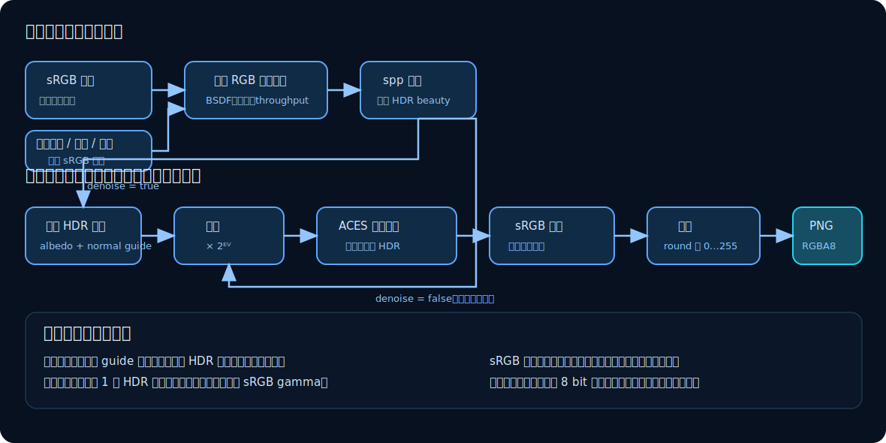

# 08　降噪、色调映射与输出

路径积分器输出的是浮点线性 HDR 辐亮度，而显示器和 PNG 通常使用有限范围的 sRGB 8 bit 数值。从前者到后者必须经过一条明确的颜色管线：

~~~text
sRGB 图像纹理解码
  → 在线性 RGB 中计算路径贡献
  → spp 平均
  → 可选 OptiX HDR 降噪
  → 2^EV 曝光
  → 逐通道 ACES 风格拟合曲线
  → 精确分段 sRGB 编码
  → 四舍五入到 RGBA8 PNG
~~~

*图 7：非线性的显示变换全部位于样本平均之后。降噪与色调映射改变最终图像，但不是渲染方程中的光传输。*

## 1. 为什么必须在线性空间计算

物理光贡献可以相加。例如两盏同样的灯照到一点，线性辐亮度应变为两倍。sRGB 像素值为了适应显示和人眼感知，已经做过非线性编码，不能直接相加或平均。

标记为 sRGB 的纹理在设备采样后，对 RGB 每个通道执行

$$
c_{\text{linear}}=
\begin{cases}
c_{\text{sRGB}}/12.92,
&c_{\text{sRGB}}\le0.04045,\\
\left(\dfrac{c_{\text{sRGB}}+0.055}{1.055}\right)^{2.4},
&c_{\text{sRGB}}>0.04045.
\end{cases}
$$

alpha 通道不代表亮度，不做 sRGB 解码。标记为 `linear` 的图像与 JSON 中的 `base_color`、`emission` 常量也直接作为线性数值使用。

所有 BSDF、吞吐量、直接光、路径累积和 spp 平均都在线性 RGB 中进行。

一个实现限制是：CUDA texture object 先对 8 bit sRGB 码值做双线性过滤，`sample_texture` 在 `tex2D` 返回后才手工解码。因此路径计算使用的是解码后的线性值，但 sRGB 纹理的**插值本身**并非在线性空间完成，和“先逐 texel 解码再过滤”的严格结果略有差异。

## 2. 首命中引导层

raygen 除 beauty 外，还输出两种降噪引导信息。每条样本路径只在第一个有效交点写入：

- **albedo**：首命中处纹理调制后的 `base_color`；
- **normal**：首命中法线在相机基 $(\mathbf u,\mathbf v,\mathbf w)$ 上的三个投影。

每像素先对 spp 份引导值求平均，法线平均后再归一化。未命中背景的样本不写引导，因此它们对平均值贡献零。

这些缓冲区帮助降噪器区分“随机亮度波动”和真实的材质/几何边缘。它们不是独立渲染通道：albedo 对金属或发光材质也只是当前实现提供的特征，不应解释成严格的漫反射反照率分解。

## 3. OptiX HDR 降噪

场景启用 `denoise` 时，[`run_denoiser`](../../src/optix_renderer.cpp) 创建 OptiX HDR denoiser，并传入 beauty、albedo 和相机空间 normal：

- 先从 HDR beauty 计算强度尺度；
- `blendFactor = 0`，输出完全采用降噪结果，而非与原图混合；
- 降噪发生在曝光和显示变换之前，保留 HDR 输入关系。

降噪器利用空间结构和训练得到的先验预测低噪图像。它能显著改善低 spp 结果，但可能平滑细节、改变亮点或产生重建伪影。它不增加 Monte Carlo 样本，也不属于无偏积分器的一部分。

## 4. EV 曝光

对原始或降噪后的线性值 $c$，先乘

$$
x=\max(0,c)\,2^{EV}.
$$

因此 EV +1 把线性值乘 2，EV −1 除以 2。曝光只改变怎样把已有 HDR 数值映射到显示范围，不会补回场景中缺失的照明或更长路径。

若输入通道不是有限数，后处理将其替换为 0；负值也在色调曲线入口钳到 0。

## 5. ACES 风格拟合曲线

线性 HDR 可能远大于 1，直接截断会让高光全部变成纯白。SpectralDock 逐通道使用

$$
T(x)=\mathrm{clamp}\left(
\frac{x(2.51x+0.03)}{x(2.43x+0.59)+0.14},
0,1
\right).
$$

它在暗部近似保留差异，同时把很亮的数值平滑压缩到 1 附近。

这应准确称为 **ACES-inspired fitted curve（ACES 风格拟合曲线）**，而不是完整 ACES 色彩管理流程。实现没有 ACES 色彩空间转换、完整 RRT/ODT、显示设备选择或色域映射；逐 RGB 通道独立压缩还可能改变饱和高光的色相。

## 6. sRGB 输出编码

色调映射后的线性显示值 $T\in[0,1]$ 再编码为 sRGB：

$$
c_{\text{sRGB}}=
\begin{cases}
12.92T,&T\le0.0031308,\\
1.055T^{1/2.4}-0.055,&T>0.0031308.
\end{cases}
$$

这不是简单的“gamma 2.2”；暗部是线性段，亮部指数也是 $1/2.4$。输入纹理解码与输出编码使用对应的精确分段函数。

最后四舍五入并钳制：

$$
b=\mathrm{clamp}
\left(\left\lfloor255c_{\text{sRGB}}+0.5\right\rfloor,0,255\right).
$$

RGB 三个通道写入 `uchar4`，alpha 固定为 255。主机把 RGBA8 缓冲区写成 PNG；最终 PNG 不再保留色调映射前的 HDR 数值。

## 7. 一个数值例子

假设一个线性通道值为 $c=2$，曝光 EV = −1：

1. 曝光后 $x=2\times2^{-1}=1$；
2. 拟合曲线给出
   $$
   T(1)=\frac{2.54}{3.16}\approx0.804;
   $$
3. sRGB 编码约为
   $$
   1.055(0.804)^{1/2.4}-0.055\approx0.908;
   $$
4. 8 bit 值约为 $\mathrm{round}(0.908\times255)=232$。

这个例子也说明“线性值 2”并非溢出。HDR 阶段允许保存它，直到最后决定如何显示。

## 8. 对应实现

- 输入纹理解码：[`sample_texture`、`srgb_channel_to_linear`](../../src/device_programs.cu)
- spp 平均和首命中 guide：[`__raygen__pathtrace`](../../src/device_programs.cu)
- 可选 HDR 降噪：[`run_denoiser`](../../src/optix_renderer.cpp)
- 曝光、拟合曲线、sRGB 和量化：[`src/postprocess.cu`](../../src/postprocess.cu)
- PNG 编码：[`src/image_io.cpp`](../../src/image_io.cpp)

最后一章将把“噪声、偏差、模型限制、性能计时和软件测试”分开，说明怎样判断渲染结果是否可信。

[上一章：OptiX/GPU 实现](07-optix-gpu-implementation.md) · [返回目录](README.md) · [下一章：边界、性能与验证](09-limitations-performance-and-validation.md)
