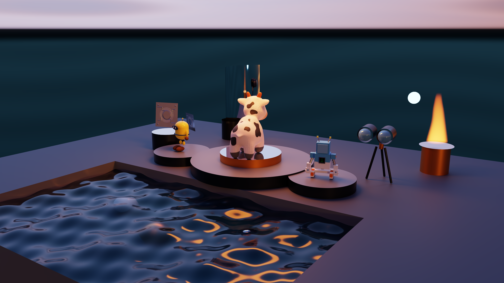

# SpectralDock 渲染技术报告

这组报告解释 SpectralDock **为什么能够把一个场景变成一张图**，HDR 环境、程序化体积火焰与解析水面怎样参与光传输，以及 PhysX 核心子系统怎样为物理场景即时构建可渲染的刚体状态。重点不是命令怎么运行，而是数学模型为什么成立，以及这些公式怎样对应到当前 GPU 实现。

报告不要求计算机图形学先修。正文会从直觉解释所需的向量、微积分和概率概念，再把关键公式与当前源码中的真实代码片段并排说明。

> 上图由 SpectralDock 路径追踪器直接输出。“暮潮观测站”是固定姿态的纯 Renderer 场景，不创建 `PhysicsWorld`、不启动 PhysX worker；它把 HDR 环境、PBR/法线贴图、光泽金属与低粗糙度 PBR 光学外壳、解析水面与 Beer 吸收、程序化火焰和有限灯光组合在一帧中。报告同时保留对 Kinetic Foundry 与“熔岩圣殿的机械先知”两套 PhysX 专题场景的完整说明。

## 核心问题：一个像素如何得到颜色

~~~mermaid
flowchart LR
    A["在像素内随机取样"] --> B["生成相机射线"]
    B --> C["寻找最近交点"]
    C --> D{"命中了什么？"}
    D -->|背景或发光面| E["累积辐亮度贡献"]
    D -->|普通表面| F["估计有限、环境与 delta 直接光并随机散射"]
    F --> C
    E --> K["可选 direct / indirect 贡献钳位"]
    K --> G["多条样本路径取平均"]
    G --> H["可选降噪"]
    H --> I["曝光、色调映射、sRGB 编码"]
    I --> J["8 bit PNG 像素"]
~~~

路径追踪从相机端反向寻找可能到达相机的光路。这只是求解方向；物理世界中的光仍然从光源传播到相机。

## 推荐阅读顺序

1. [向量、射线与相机](01-vectors-rays-and-camera.md)：建立后面所有几何公式需要的语言。
2. [光的度量与渲染方程](02-light-and-rendering-equation.md)：明确渲染器最终在求什么积分。
3. [材质与 BSDF](03-materials-and-bsdf.md)：解释漫反射、GGX VNDF 粗糙金属、PBR 金属度工作流、MikkTSpace 法线贴图和玻璃如何改变光的方向。
4. [Monte Carlo 路径追踪](04-monte-carlo-path-tracing.md)：把连续积分变成有限条随机路径，并推导有偏 firefly 贡献钳位。
5. [直接光照、NEE 与 MIS](05-direct-lighting-and-mis.md)：解释面积灯、球锥、point/directional delta NEE，以及普通双策略 MIS 和竞争策略真实存在的条件。
6. [HDR 环境与重要性采样](06-hdr-environment-and-importance-sampling.md)：从 RGBE 解码、纬经映射和 texel 立体角出发，推导环境二维 CDF、全局有限灯功率分布、三个 NEE 域及环境 MIS。
7. [几何、可见性与 BVH](07-geometry-visibility-and-bvh.md)：追踪 CPU 几何到 CUDA 缓冲区、`OptixBuildInput`、GAS/IAS，再说明最近交点和阴影遮挡。
8. [OptiX/GPU 实现](08-optix-gpu-implementation.md)：以 `render_optix` 为总入口，连起构建期 OptiX IR、context/pipeline/SBT、launch、traversal/callback 和资源销毁。
9. [降噪、色调映射与输出](09-denoising-color-and-output.md)：展开可选 Denoiser 的完整生命周期，并划清纯 CUDA 后处理、D2H 和 CPU PNG/PFM 编码的边界。
10. [程序化体积火焰](10-procedural-volumetric-flame.md)：从吸收—自发光传输方程出发，解释程序密度、Delta Tracking、体积 NEE、估计器分工与安全统计。
11. [运行时解析水面](11-runtime-analytic-water.md)：从正弦高度场与解析法线出发，解释自定义求交、粗糙介电 GGX、Fresnel/Snell、介质栈、Beer 吸收、$q_G+q_U$ 双提议与 G/U/B balance，以及光滑首水面有界分裂。
12. [PhysX 刚体模拟与 Python 场景即时构建](12-physx-rigid-body-scene-baking.md)：从 Newton–Euler、冲量、接触约束、复合刚体和碰撞代理出发，解释 Kinetic Foundry 与熔岩圣殿专题的 GPU 刚体姿态怎样经 private IPC 和 typed attachments 进入 SceneBuilder。
13. [边界、性能与验证](13-limitations-performance-and-validation.md)：区分物理模型边界、近似误差、性能指标和软件测试，并从一个像素重新串起全文。

如果只想先建立渲染整体认识，可读第 1、2、4、5、6、9、13 章，再返回其余章节；第 10 章扩展无散射参与介质，第 11 章扩展运行时解析介电边界，第 12 章解释物理场景的 Python 即时构建与隔离 worker 交接链。

## 全文方向约定

在一个表面点 $\mathbf x$ 上：

- $\mathbf n_g$ 是决定射线位于几何哪一侧的单位几何法线；
- $\mathbf n_s^{\mathrm{eff}}$ 是面向当前出射方向、用于 BSDF 求值与采样的有效着色法线；
- $\boldsymbol\omega_o$ 从表面指向上一顶点或相机；
- $\boldsymbol\omega_i$ 从表面指向光源或下一顶点；
- 两个方向都从交点向外。虽然 $\boldsymbol\omega_i$ 叫“入射方向”，光实际沿 $-\boldsymbol\omega_i$ 到达表面。

这是 SpectralDock 源码采用的约定：`wo = -ray_direction`，新射线沿 `wi` 发出。统一方向后，点积、Fresnel、折射和 PDF 公式才不会互相矛盾。

## 常用符号

| 符号 | 含义 | 单位或范围 |
|---|---|---|
| $\mathbf x,\mathbf y$ | 三维空间中的点 | 场景长度单位 |
| $\mathbf v,\boldsymbol\omega$ | 向量；带帽或 $\boldsymbol\omega$ 通常是单位方向 | 无量纲 |
| $\mathbf n_g,\mathbf n_s^{\mathrm{eff}}$ | 单位几何法线、有效着色法线 | 无量纲 |
| $L_i,L_o,L_e$ | 入射、出射、自发光辐亮度 | 本项目用线性 RGB 近似 |
| $f_s$ | BSDF，描述方向之间的散射比例 | sr$^{-1}$，delta 事件除外 |
| $p(\cdot)$ | 概率密度函数 PDF | 随测度而变 |
| $\boldsymbol\beta$ | 一条随机路径当前的 RGB 吞吐量 | 无量纲权重 |
| $\odot$ | RGB 逐分量相乘 | 例如 $(a_r b_r,a_g b_g,a_b b_b)$ |

报告中的 RGB 指**线性 RGB**，除非明确写出 sRGB。公式中的颜色可以大于 1；它们会在最后统一映射到显示范围。

## 数学、实现与验证的关系

~~~text
渲染方程（目标）
    ↓
Monte Carlo、重要性采样、NEE、MIS（数值方法）
    ↓
射线求交、材质模型、路径状态（算法）
    ↓
OptiX、CUDA、BVH、SBT（GPU 实现）
    ↓
测试与基准（检查实现是否符合上述约定）
~~~

因此，测试和验收不是项目主角；它们是保护渲染器数学含义和工程行为不被意外破坏的证据。

两个物理场景还存在一条进入上述链条之前的必经路径：普通 Python 程序先创建 `PhysicsWorld`，经只存在于 `TemporaryDirectory` 的 private IPC 启动 CUDA 12.8 / PhysX GPU worker；返回的数值与父进程保留的 typed Renderer handles 重新结合，由 `PhysicsResult.apply_to` 直接加入 SceneBuilder，然后进入普通 OptiX 渲染流程。持久 `.physics.json` 只是审计记录，不是场景输入。旧八个静态教学程序与五个纯 Renderer Gallery 程序都不经过这一步。第 12 章完整展开这条边界。

## 报告与源码

关键推导旁的“源码对照”直接摘录当前仓库中的连续代码：不加入省略号，不把代码改写成伪代码，也不依赖容易漂移的行号。每个带标记的片段都由 pytest 逐字核对其来源；结构测试还检查目录、导航、链接和若干关键语义。它们能捕获被覆盖的漂移，但不能代替实现变化后的人工技术审阅。片段后的说明负责指出公式符号对应的变量、控制流对应的数学条件，以及数值保护或性能优化位于哪里。

章末仍保留函数和文件入口，便于继续阅读完整上下文。主要入口包括：

- 单帧 OptiX 总流程：[`render_optix`](../../src/optix_renderer.cpp)
- 路径积分器：[`__raygen__pathtrace`](../../src/device_programs.cu)
- BSDF 与灯光采样：[`evaluate_bsdf`、`sample_bsdf`、`sample_finite_direct_light`、`sample_environment_direct_light`、`accumulate_delta_direct_lights`](../../src/device_programs.cu)
- Firefly 控制：[`clamp_path_contribution`](../../src/device_programs.cu)
- GPU 管线与加速结构：[`create_pipeline`、`build_mesh`、`build_ias`、`make_sbt`](../../src/optix_renderer.cpp)
- 后处理：[`postprocess_kernel`](../../src/postprocess.cu)
- 主机输出：[`write_png_rgba8`](../../src/image_io.cpp)
- PhysX Python API、private IPC 与 typed handoff：[`physics.py`](../../python/spectraldock/physics.py)
- CUDA 12.8 / PhysX GPU worker：[`physx_worker.cpp`](../../tools/physx_worker.cpp)
- Kinetic Foundry 物理程序：[`kinetic-foundry.py`](../../scenes/kinetic-foundry.py)
- 熔岩圣殿 PhysX 专题程序：[`lava-temple-oracle.py`](../../scenes/lava-temple-oracle.py)
- 体积密度与传输：[`flame_density`、`track_volume`](../../src/device_programs.cu)
- 水面与介质传输：[`water_height`、`__intersection__water_surface`、`direct_segment_transmittance`、`sample_bsdf`](../../src/device_programs.cu)

这是一份“与当前实现一致”的技术报告，不把 SpectralDock 描述成通用物理仿真器，也不把 Python 父进程与隔离 PhysX worker 组成的即时场景构建描述成同进程逐帧物理。每章都会明确当前实现的近似与边界。
